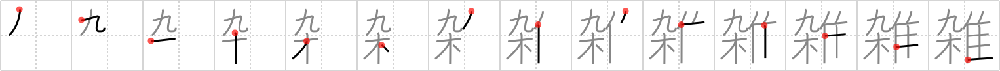

## `miscellaneous`

## [14]

## Reading:

### On-Yomi: ザツ、ゾウ &mdash; Kun-Yomi: まじ.える、まじ.る

## Heisig story:

Baseball . . . trees . . . turkey.

## Koohii stories:

1) [<a href="http://kanji.koohii.com/profile/esaulgd">esaulgd</a>] 13-2-2007(297): Newscast: &quot;Among today&#039;s<strong> miscellaneous</strong> stories, we have a report on a <em>baseball</em> team that was chased up a <em>tree</em> by a <em>turkey</em>. Stay tuned for this and more!&quot;.

2) [<a href="http://kanji.koohii.com/profile/raulir">raulir</a>] 25-4-2006(69): On the left we have baseball and wood, which obviously means a baseball bat. Instead of balls, there are<strong> miscellaneous</strong> other objects you may hit with it. While beating people may be one favorite use, in this case we see it used for making turkey mash.

3) [<a href="http://kanji.koohii.com/profile/tcjeff">tcjeff</a>] 7-6-2008(57): &quot;<em>Nine</em> <em>wood</em>en <em>turkeys</em>?&quot; asked the official directing people at the antiques roadshow, &quot;I suppose you should head over to the<strong> miscellaneous</strong> department to get them appraised.&quot;.

4) [<a href="http://kanji.koohii.com/profile/xxinde">xxinde</a>] 21-4-2009(51): Among the<strong> miscellaneous</strong> birds sitting on a tree (<em>nine</em> in total), the biggest one is a <em>turkey</em>.

5) [<a href="http://kanji.koohii.com/profile/cingold">cingold</a>] 14-8-2009(36): Trying to Ebay the <em>Nine Wooden Turkeys</em> I found in the loft I couldn&#039;t find a category, so I had to stick with<strong> Miscellaneous</strong>.

6) [<a href="http://kanji.koohii.com/profile/vinniram">vinniram</a>] 6-12-2009(18): Here&#039;s a<strong> MISCELLANEOUS</strong> fact: there are only <em>nine</em> <em>trees</em> in <em>Turkey</em>!!!

7) [<a href="http://kanji.koohii.com/profile/dingomick">dingomick</a>] 15-2-2007(17): They ran out of balls at the game so they started pitching<strong> miscellaneous</strong> things. (Image: a pitcher with a pile of<strong> miscellaneous</strong> junk next to him. Imagine the whole pitch: grabs the <em>turkey</em> by the neck, checks the runner on 1st, hurls the <em>turkey</em>, the <em>baseball bat</em> (9 tree) connects, and the <em>turkey</em> explodes).

8) [<a href="http://kanji.koohii.com/profile/eatyoda">eatyoda</a>] 6-9-2008(13): The <em>turkeys</em> launched <em>tree</em> <strong>missiles up the anus</strong> of the <em>baseball team</em>.

9) [<a href="http://kanji.koohii.com/profile/brose">brose</a>] 25-11-2006(11): At the <em>baseball</em> game, your hotdog is made of <em>turkey</em>, <em>sawdust</em> and other<strong> miscellaneous</strong> ingredients.

10) [<a href="http://kanji.koohii.com/profile/quety101">quety101</a>] 29-7-2009(9): Only in the<strong> miscellaneous</strong> department can you buy 9 wooden turkeys.

### {V4: 562, V6: 604}
