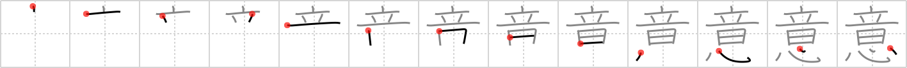

## `idea`

## [13]

## Reading:

### On-Yomi: イ

## Heisig V6:

Sound . . . heart.

## Koohii stories:

1) [<a href="http://kanji.koohii.com/profile/onsen_monkey">onsen_monkey</a>] 4-10-2006(325): When you get a good<strong> IDEA</strong> you get excited and you can hear the SOUND of your HEART, it&#039;s pounding so hard.

2) [<a href="http://kanji.koohii.com/profile/fuaburisu">fuaburisu</a>] 11-10-2005(58): Picture someone who&#039;s just had a great<strong> idea</strong>, but in place of a blinking light bulb over their head, you see a <em>heart</em> thumping with great <em>noise</em>. Imagine the greater the<strong> idea</strong>, the louder the <em>sound</em> of the beating <em>heart</em>.

3) [<a href="http://kanji.koohii.com/profile/nilfisq">nilfisq</a>] 26-8-2007(38): The best<strong> idea</strong>s are <em>sound</em><strong> idea</strong>s that come right from the <em>heart</em>!

4) [<a href="http://kanji.koohii.com/profile/Atomik">Atomik</a>] 14-2-2010(32): The Frenchman René-Théophile-Hyacinthe Laennec is best known for a great<strong> idea</strong> he had in 1816, when he invented a device to listen to the <em>sound</em> of a patient&#039;s <em>heart</em>: the stethoscope. Until then, doctors simply put their ears against people&#039;s chests, which was ineffective for overweight patients and embarrassing for female patients. Laennec&#039;s<strong> idea</strong> was so great that doctors still rely on it today.

5) [<a href="http://kanji.koohii.com/profile/aelirri">aelirri</a>] 14-5-2009(15): A good <strong>idea</strong> will always <em>sound</em> right in your heart.

6) [<a href="http://kanji.koohii.com/profile/dnanoodle">dnanoodle</a>] 26-11-2009(8): <em>Sound</em><strong> idea</strong>s come from the <em>heart</em>.

7) [<a href="http://kanji.koohii.com/profile/killtheclock">killtheclock</a>] 5-2-2009(7): Ein starker <strong>Wille</strong> ist im ein<em>klang</em> mit dem Herzen. Ich stelle mir vor wie sich der Anführer vor versammelter Mannschaft auf die Brust schlägt und das <em>Herz</em> darin dröhnt mit Glocken<em>klang</em>.

8) [<a href="http://kanji.koohii.com/profile/mezbup">mezbup</a>] 10-1-2009(6): My heart likes the sound of that<strong> idea</strong>.

9) [<a href="http://kanji.koohii.com/profile/tsenita">tsenita</a>] 20-7-2009(5): The inventor of the stethoscope said... &quot;I&#039;ve got a great<strong> idea</strong>! My<strong> idea</strong> is for a new invention, a device that lets doctors listen to the <em>sound</em> of the <em>heart</em>! What a great<strong> idea</strong> this is!&quot;.

10) [<a href="http://kanji.koohii.com/profile/diracbracket">diracbracket</a>] 26-11-2007(5): Whenever I have an<strong> idea</strong>, a heart, not a light bulb, appears over my head with a DING sound.
