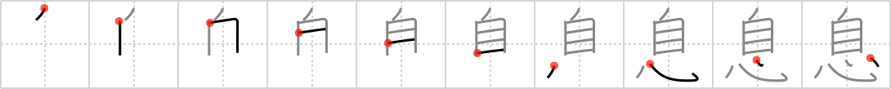

## `breath`

## [10]

## Reading:

### On-Yomi: ソク &mdash; Kun-Yomi: いき

## Heisig V6:

Nose . . . heart.

## Koohii stories:

1) [<a href="http://kanji.koohii.com/profile/Howdoken">Howdoken</a>] 14-1-2008(316): Your<strong> breath</strong> brings oxygen in through your <em>nose</em> which is then pumped around your body by your <em>heart</em>.

2) [<a href="http://kanji.koohii.com/profile/Shibo">Shibo</a>] 31-3-2008(102): I think I&#039;ve met my dream girl, but there&#039;s a problem. her<strong> breath</strong> is horrible! So, do I listen to my <em>nose</em> or my <em>heart</em>?

3) [<a href="http://kanji.koohii.com/profile/wynterp">wynterp</a>] 3-9-2007(48): From Genesis 2:7 (NKJV): Creating man. God &quot;breathed into his <em>nostrils</em> the<strong> breath</strong> of life and the man became a living being.&quot; (can&#039;t you see his <em>heart</em> start pumping?).

4) [<a href="http://kanji.koohii.com/profile/Izumo">Izumo</a>] 4-3-2010(16): <strong>BREATH</strong> brings oxygen from your <em>nose</em> to your <em>heart</em>.

5) [<a href="http://kanji.koohii.com/profile/timcampbell">timcampbell</a>] 26-11-2007(15): Someone has almost drowned. We plug their NOSE as we<strong> breath</strong> into them, then listen to see if the HEART starts beating.

6) [<a href="http://kanji.koohii.com/profile/trurlo">trurlo</a>] 15-1-2010(7): <strong>breath</strong> happens &quot;by <em>oneself</em>&quot;, as well as <em>heart</em>beat.

7) [<a href="http://kanji.koohii.com/profile/Perry">Perry</a>] 10-3-2009(7): Tai chi exercise -<strong> breath</strong> through your <em>nose</em> to your <em>heart</em>.

8) [<a href="http://kanji.koohii.com/profile/lagwagon555">lagwagon555</a>] 8-6-2009(6): Your<strong> breath</strong> is so bad, when your partner smells it (with thier nose), they get a heartattack.

9) [<a href="http://kanji.koohii.com/profile/dizzwave">dizzwave</a>] 11-7-2008(6): This kanji was created in the old days, before people knew about lungs. They thought that the<strong> breath</strong> came in through the <em>nose</em>, and went straight down to the <em>heart</em>.

10) [<a href="http://kanji.koohii.com/profile/kanjihito">kanjihito</a>] 7-12-2011(4): What the <em>nose</em> does to keep the <em>heart</em> pumping oxygen.
