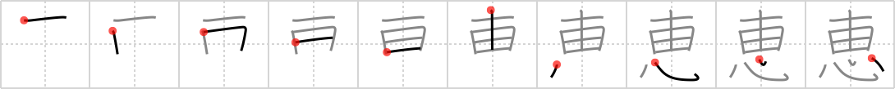

## `favor`

## [10]

## Reading:

### On-Yomi: ケイ、エ &mdash; Kun-Yomi: めぐ.む、めぐ.み

### Examples: 恵贈 (けいぞう), 恵与 (けいよ), 恩恵 (おんけい), 恵む (めぐ.む)

## Words:

恵み(めぐみ): blessing

恵む(めぐむ): to bless, to show mercy to

恩恵(おんけい): grace, favor, blessing, benefit

知恵(ちえ): wisdom, wit, sagacity, sense, intelligence, advice

恵まれる(めぐまれる): be blessed with, be rich in

## Koohii stories:

1) [<a href="http://kanji.koohii.com/profile/Nukemarine">Nukemarine</a>] 13-8-2007(763): Too easy. Imagine the Wizard of OZ. There, the three heroes asked the Wizard for three<strong> FAVOR</strong>S: the lion wanted courage of TEN men, the scarecrow wanted a BRAIN, and the tin man wanted a HEART. Ok, the lion bit is stretching but you have it memorized now, so who cares? 

2) [<a href="http://kanji.koohii.com/profile/samuize">samuize</a>] 15-3-2007(38): If you would give someone 10 fields as a<strong> favor</strong> then you truly have a big heart. Or, people who do lots of<strong> favor</strong>s for others have a heart as big as 10 fields, a &quot;10-field-heart&quot;. 

3) [<a href="http://kanji.koohii.com/profile/joxn_costello">joxn_costello</a>] 7-12-2008(33): &quot;Igor, do me a<strong> favor</strong>: go down to the morgue and pick me up <em>ten</em> <em>brains</em> -- oh, and a <em>heart</em>, if they have any fresh!&quot;. 

4) [<a href="http://kanji.koohii.com/profile/usis35">usis35</a>] 6-7-2008(19): -Do me a<strong> FAVOR</strong>, give me TEN FIELDS (I am talking to someone who owns a lot of fields), and I will thank you from my HEART ! 

5) [<a href="http://kanji.koohii.com/profile/jameserb">jameserb</a>] 13-2-2008(12): &quot;Ten fields and my heart for my lady&#039;s<strong> favor</strong>!&quot; cried Lord Fancypants. 

6) [<a href="http://kanji.koohii.com/profile/synewave">synewave</a>] 11-9-2007(11): One of my<strong> favor</strong>ite scenes from Pulp Fiction. Vincent Vega did Mia Wallace a<strong> favor</strong> by sticking a needle not into her <em>brain</em>, but into her <em>heart</em>. Mnemonic &quot;Do <strong>Mia</strong><strong> favor</strong>&quot;. 

7) [<a href="http://kanji.koohii.com/profile/rowdyphantom">rowdyphantom</a>] 5-4-2010(9): I dropped my <em>needle</em> in that <em>rice field</em>-- umm, Sweet<em>heart</em>, can you do me a<strong> favor</strong>...? 

8) [<a href="http://kanji.koohii.com/profile/Atomik">Atomik</a>] 2-1-2010(6): Do me a<strong> favor</strong> and get this <em>needle</em> out of my brain. I can&#039;t <em>think</em>. 

9) [<a href="http://kanji.koohii.com/profile/jbrooks42">jbrooks42</a>] 16-6-2009(6): Do your <em>heart</em> a<strong> favor</strong>: get in shape by plowing <em>ten fields</em>! 

10) [<a href="http://kanji.koohii.com/profile/Asriel">Asriel</a>] 15-3-2009(5): If a friend asks you for a<strong> favor</strong>, some might tell you to &quot;<em>think</em> twice,&quot; but trust me, that&#039;s not enough. Be sure to <em>think</em> at least <em>ten</em> times. 
