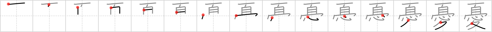

## `melancholy`

## [15]

## Reading:

### On-Yomi: ユウ &mdash; Kun-Yomi: うれ.える、うれ.い、う.い、う.き

## Koohii stories:

1) [<a href="http://kanji.koohii.com/profile/rizzo">rizzo</a>] 7-2-2006(244): <strong>Melancholy</strong> makes me think of Hamlet cause he was so &#039;emo&#039;. In order to play up his feelings he bares his <em>head</em> and holds his <em>crown</em> over his <em>heart</em> then walks (on <em>walking legs</em>) around the palace making everyone see how<strong> melancholy</strong> he is. What a wuss. 

2) [<a href="http://kanji.koohii.com/profile/howdycowdy">howdycowdy</a>] 24-3-2008(155): This is an image of the crucifixion. Jesus is on the cross. His <em>crown</em> of thorns has slipped down and is around his neck, right between his <em>head</em> and his <em>heart</em>. His <em>walking legs</em> can be seen dangling from the cross as well. How<strong> MELANCHOLY</strong>! 

3) [<a href="http://kanji.koohii.com/profile/Katsuo">Katsuo</a>] 12-11-2007(114): In the middle of <em>summer</em> you lose both your <em>crown</em> and your <em>heart</em>. No wonder you feel<strong> melancholy</strong>. 

4) [<a href="http://kanji.koohii.com/profile/FutureBlues">FutureBlues</a>] 16-7-2008(43): In the<strong> Melancholy</strong> of Suzumiya Haruhi, reality was all in her <em>head</em>, leading to situations where her melancholic feelings in her <em>heart</em> would be released into bubble-like <em>crowns</em> of negative space where they&#039;d <em>walk around on their legs</em> and wreck havoc. 

5) [<a href="http://kanji.koohii.com/profile/skinnyneo">skinnyneo</a>] 24-9-2007(26): The most<strong> melancholy</strong> places of all is a funeral. This is a funeral for the Burger King guy, where everybody takes the paper <em>crowns</em> that they were given off of their <em>head</em> and covers their <em>heart</em> with it. <em>Each</em> person then uses their <em>walking legs</em> to come up to the casket and throw in a whopper. 

6) [<a href="http://kanji.koohii.com/profile/Rujiel">Rujiel</a>] 10-9-2009(23): Even in the <em>middle of summer</em> (literally),<strong> melancholy</strong> <em>crowns</em> my <em>heart</em>. 

7) [<a href="http://kanji.koohii.com/profile/LuggLD">LuggLD</a>] 23-6-2009(18): In reference to rizzo&#039;s <strong>melancholic</strong> Hamlet story, I found it a lot easier to remember this kanji using the rhyme: On his <em>head</em> he wore a <em>crown</em>, in his <em>heart</em> he <em>walked around</em>. 

8) [<a href="http://kanji.koohii.com/profile/mickymay">mickymay</a>] 20-3-2012(11): Great story: think of one of those old guys you met in a bar that whines in<strong> melancholy</strong> about his great days and how they are gone. He goes &quot;Once, I myself, was the king of hearts, but those days have gone&quot; Once, (  <a href="http://jisho.org/kanji/details/一">一</a>  ) I myself (  <a href="http://jisho.org/kanji/details/自">自</a>  ) king (crown wearing) hearts (  <a href="http://jisho.org/kanji/details/心">心</a>  ) gone (as in walked away). 

9) [<a href="http://kanji.koohii.com/profile/wakeuplan">wakeuplan</a>] 11-8-2009(11): In the<strong> Melancholy</strong> of Haruhi Suzumiya, the natural progression of SUMMER is interupted when Haruhi (wearing the figurative CROWN of God) and her HEART get in the middle of things. The result? We have entered an endless recursion of time. 

10) [<a href="http://kanji.koohii.com/profile/killtheclock">killtheclock</a>] 9-2-2009(10): Anlass zum <strong>Trübsinn</strong> bereiten mir die religiösen Stelen am Wegesrand: Jesus<em>kopf</em> mit <em>Krone</em> und blutenden <em>Herzen</em> - da muß der Wanderer ja <strong>Trübsinn</strong>ig werden. Man beachte wie sich der Kopf mit der Krone verbindet - leider ist sie aber über den Kopf gerutscht und hängt am Hals - es ist zum heulen. 
