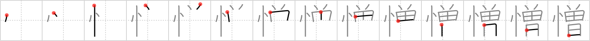

# {憎}

## Strokes: 14

## Reading:

### On-Yomi: ゾウ &mdash; Kun-Yomi: にく.む、にく.い、にく.らしい、にく.しみ

### Examples: 憎い (にく.い), 憎しみ (にく.しみ), 憎む (にく.む), 憎らしい (にく.らしい)

## Words:

愛憎(あいにく): likes and dislikes

憎しみ(にくしみ): hatred

憎い(にくい): hateful, abominable, poor-looking, detestable, (with irony) lovely, lovable, wonderful

憎む(にくむ): hate, detest

憎らしい(にくらしい): odious, hateful
