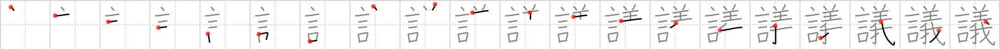

# {議}

## `deliberation`

## Strokes: 20

## Reading:

### On-Yomi: ギ

## Words:

異議(いぎ): objection, dissent, protest

議案(ぎあん): legislative bill

議決(ぎけつ): resolution, decision, vote

議事堂(ぎじどう): Diet building

議題(ぎだい): topic of discussion, agenda

協議(きょうぎ): conference, consultation, discussion, negotiation

決議(けつぎ): resolution, vote, decision

抗議(こうぎ): protest, objection

合議(ごうぎ): consultation, conference

参議院(さんぎいん): House of Councillors

衆議院(しゅうぎいん): Lower House, House of Representatives

審議(しんぎ): deliberation

討議(とうぎ): debate, discussion

物議(ぶつぎ): public discussion (criticism)

論議(ろんぎ): discussion

議員(ぎいん): member of the Diet, congress or parliament

議会(ぎかい): Diet, congress, parliament

議長(ぎちょう): chairman

議論(ぎろん): argument, discussion, dispute

不思議(ふしぎ): wonder, miracle, strange, mystery, marvel, curiosity

会議(かいぎ): meeting
