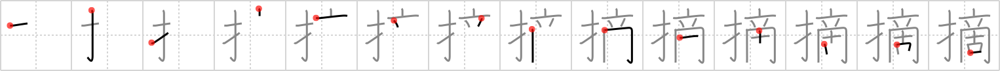

## `pinch`

## [14]

## Reading:

### On-Yomi: テキ &mdash; Kun-Yomi: つ.む

## Heisig story:

Finger . . . antique.

## Koohii stories:

1) [<a href="http://kanji.koohii.com/profile/zwarte_kat">zwarte_kat</a>] 16-4-2007(257): My grandma always<strong> pinch</strong>ed me with her fingers when i was playing with her antiques. Imagine her fingers, also quite antique, thin, bony and hard,<strong> pinch</strong>ing at your hand. &quot;Keep your fingers away from my antiques!!&quot;.

2) [<a href="http://kanji.koohii.com/profile/Transtic">Transtic</a>] 3-1-2008(60): &gt;_&lt; Don&#039;t you hate when your aunt (who is an <strong>antique</strong>) <strong>PINCH</strong>ES your cheeks with her <strong>antique</strong> <strong>fingers</strong>?

3) [<a href="http://kanji.koohii.com/profile/tomtosh">tomtosh</a>] 17-5-2011(14): To many, a<strong> pinch</strong> of snuff, taken with the <em>fingers</em>, is an antique <em>habit</em>.

4) [<a href="http://kanji.koohii.com/profile/thegeelonghellswan">thegeelonghellswan</a>] 21-9-2008(14): While admiring the antiques in a museum an old woman<strong> pinch</strong>ed my bottom with her fingers.

5) [<a href="http://kanji.koohii.com/profile/penot">penot</a>] 15-11-2008(10): My <em><strong>antique</strong></em> auntie - she likes to <strong>pinch</strong> my cheeks with her <em><strong>antique fingers</strong></em>, ewww... --- but me - I like to <em><strong>finger</strong></em> and <strong>pinch</strong> her <em><strong>antiques</strong></em> and sell them on ebay. // transtic &amp; colonel32 // <strong>テキ zhai1 적 (jeog)</strong>.

6) [<a href="http://kanji.koohii.com/profile/shimouma">shimouma</a>] 10-4-2008(8): I had to<strong> pinch</strong> myself to keep awake when the antiques roadshow came on TV when I was a kid.

7) [<a href="http://kanji.koohii.com/profile/kreios">kreios</a>] 27-12-2010(7): You walk into an <em>antique</em> store and get yourself a &#039;five <em>finger</em> discount&#039; by <strong>pinching</strong> a nice old vase.

8) [<a href="http://kanji.koohii.com/profile/javiergakusei">javiergakusei</a>] 15-6-2007(7): For fitness enthusiasts:<strong> Pinch</strong>ing is an antique way to determine body fat percentage. (nowadays we have better methods, like under water fat measurements).

9) [<a href="http://kanji.koohii.com/profile/wonderflonium">wonderflonium</a>] 22-7-2011(5): The fingers of an old (antique) lady<strong> pinch</strong>ing your cheeks at the wedding, asking if you&#039;ll be next. They knock it off when you do it to them at funerals.

10) [<a href="http://kanji.koohii.com/profile/johngwk">johngwk</a>] 2-8-2010(5): Not many <em>fingers</em> try to<strong> pinch</strong> an <em>antique</em> bottom.
