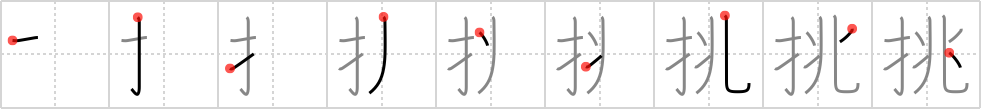

## {658}

## `challenge`

## [9]

## Reading:

### On-Yomi: チョウ &mdash; Kun-Yomi: いど.む

### Examples: 挑む (いど.む)

## Words:

挑む(いどむ): to challenge, to contend for, to make love to

挑戦(ちょうせん): challenge, defiance
