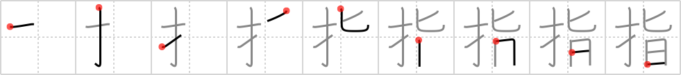

# {指}

## Strokes: 9

## Reading:

### On-Yomi: シ &mdash; Kun-Yomi: ゆび、さ.す、-さ.し

### Examples: 指す (さ.す), 指 (ゆび)

## Words:

指図(さしず): instruction, mandate

指す(さす): to point, put up umbrella, to play

指揮(しき): command, direction

指示(しじ): indication, instruction, directions

指摘(してき): pointing out, identification

指令(しれい): orders, instructions, directive

中指(ちゅうし): middle finger

指差す(ゆびさす): to point at

親指(おやゆび): thumb

薬指(くすりゆび): ring finger

小指(こゆび): little finger

指定(してい): designation, specification, assignment, pointing at

指導(しどう): leadership, guidance, coaching

中指(なかゆび): middle finger

人差指(ひとさしゆび): index finger

目指す(めざす): aim at, have an eye on

指(ゆび): finger

指輪(ゆびわ): ring
