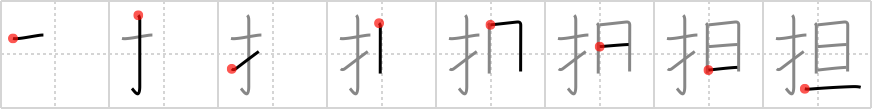

## `shouldering`

## [8]

## Reading:

### On-Yomi: タン &mdash; Kun-Yomi: かつ.ぐ、にな.う

## Koohii stories:

1) [<a href="http://kanji.koohii.com/profile/smithsonian">smithsonian</a>] 13-5-2007(296): One of Hercules&#039; labors was to hold the world in his <em>fingers</em> for Atlas and not move until <em>nightbreak</em>,<strong> shouldering</strong> the considerable burden. 

2) [<a href="http://kanji.koohii.com/profile/esaulgd">esaulgd</a>] 27-3-2007(78): One of the classic stories of<strong> shouldering</strong> a heavy burden is that of the kid who had to stick his <em>finger</em> on a dam until <em>nightbreak</em> to prevent it from breaking down. 

3) [<a href="http://kanji.koohii.com/profile/styrmis">styrmis</a>] 28-10-2007(56): A surgeon works &#039;til nightbreak, fingers working with precision,<strong> shouldering</strong> the responsibility of saving the life of the person on the operating table. 

4) [<a href="http://kanji.koohii.com/profile/Johnnyltn">Johnnyltn</a>] 15-9-2006(42): <strong>Shouldering</strong> the heavy burden of supporting one&#039;s family you work your <em>fingers</em> to the bone everyday till <em>nightbreak</em> comes. 

5) [<a href="http://kanji.koohii.com/profile/snozle">snozle</a>] 8-2-2009(31): Atlas: &quot;Hey Hercules, my <strong>shoulders</strong> kind of hurt. Do you think you can take this globe off my <strong>shoulders</strong> until <em>nightbreak</em>, I&#039;ve got a date with Aphrodite? Hercules: &quot;Of course, I can hold it with just my <em>fingers</em>!&quot; Atlas: &quot;Show off!&quot; (thanks smithsonian). 

6) [<a href="http://kanji.koohii.com/profile/Angrybeez">Angrybeez</a>] 21-8-2008(13): <strong>Shouldering</strong> the burden of the world Hercules is cheating! By using his <em>fingers</em> he&#039;s turning the globe around to make <em>nightbreak</em> come earlier!! 

7) [<a href="http://kanji.koohii.com/profile/Babyrat">Babyrat</a>] 24-10-2008(12): You have a massive debt with the Yakuza. You have to <strong>Shoulder</strong> this burden and get the money before <em>nightbreak</em> or they will break your <em>fingers</em>. 

8) [<a href="http://kanji.koohii.com/profile/MeisterLlama">MeisterLlama</a>] 28-11-2008(9): Atlas was a sissy. I took over the job of<strong> shouldering</strong> from him, but it was so easy I just held it all up with my finger. In fact, as an exercise, I did &quot;sun-lifts&quot;. I would put the sun on my finger and raise it up and below the horizon over and over. It was a pretty good work out, but the repeated <em>nightbreaks</em> freaked everyone out. 

9) [<a href="http://kanji.koohii.com/profile/Mary_K">Mary_K</a>] 19-6-2009(7): <em>Finger</em> your girl till <em>night break</em>, whether she is<strong> shouldering</strong> you or you are<strong> shouldering</strong> her. 

10) [<a href="http://kanji.koohii.com/profile/theBryan">theBryan</a>] 6-7-2008(7): Think of Atlas<strong> shouldering</strong> the Earth making it spin with his <em>fingers</em>. The spinning causes <em>night break</em> and night fall. 
