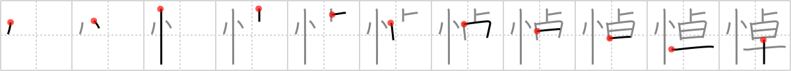

## `lament`

## [11]

## Reading:

### On-Yomi: トウ &mdash; Kun-Yomi: いた.む

## Heisig story:

To keep this character distinct from others of similar connotation, one need only think of the Prophet Jeremiah whose poetry gave an <i>eminence</i> to <i>the state of mind</i> we call <b>lamentation</b>.

## Koohii stories:

1) [<a href="http://kanji.koohii.com/profile/szreter">szreter</a>] 17-2-2008(264): When the world&#039;s most <em>eminent</em> magician died, everyone&#039;s <em>state of mind</em> became that of<strong> lament</strong>ation. He was buried with his famous sun-flower wand in his hand.

2) [<a href="http://kanji.koohii.com/profile/vosmiura">vosmiura</a>] 1-6-2007(66): <em>Data</em><strong> lament</strong>s that he could never see his <em>eminent</em> father, his creator, ever again. He paints a picture of his father, that looks like a sunflower in the shape of a magic wand.

3) [<a href="http://kanji.koohii.com/profile/ambassadog">ambassadog</a>] 11-12-2008(42): Closely related to grief, mourning and regret, it was difficult for me to isolate this kanji. A<strong> lament</strong> is a song or poem that deals with loss or regret. This brings to mind the works of the world&#039;s most <em>eminent</em> artists, their brilliance and powerful works owed to their <em>emotional states of mind</em>.

4) [<a href="http://kanji.koohii.com/profile/vicnet">vicnet</a>] 26-7-2009(22): <strong>Lament</strong> is the <em>state of mind</em> most <em>eminent</em> people live in, because so many expectations lay on their shoulders.

5) [<a href="http://kanji.koohii.com/profile/pmbeddall">pmbeddall</a>] 30-10-2007(17): Instead of using eminent - use its components - <em>divining rod</em> and <em>sunflower</em>. Think of the current state of the environment symbolized by the sunflower and use the divining rod to see the possible future - pollution, global warming, overpopulation - we have a lot to<strong> lament</strong>.

6) [<a href="http://kanji.koohii.com/profile/ashman63">ashman63</a>] 5-5-2008(15): I<strong> lament</strong> that while my <em>state of mind</em> was consumed with the <em>eminence</em> of this kanji, the <em>early-rising magician</em> stole all my lamingtons (a word that reminds me of<strong> lament</strong>). &gt;&gt;&gt;&gt;&gt;&gt;&gt;&gt;&gt;&gt;&gt;&gt;&gt;&gt;&gt; &gt;&gt;&gt;&gt;&gt;&gt;&gt;&gt;&gt;&gt;&gt;&gt;&gt;&gt;&gt;&gt;&gt;&gt;&gt;&gt; Try this rap also: <strong>Lament<strong> lamENT</strong></strong>, <em>state of mind</em> that&#039;s <em>eminENT</em>. <strong>Lament<strong> lament</strong></strong>, <em>state of mind</em> that&#039;s <em>eminent</em>. <strong>Lament<strong> lamENT</strong></strong>, <em>state of mind</em> that&#039;s <em>eminENT</em>. <strong>Lament<strong> lamENT</strong></strong>, <em>state of mind</em> that&#039;s <em>eminENT</em>. Got it!?

7) [<a href="http://kanji.koohii.com/profile/Dominik">Dominik</a>] 21-4-2008(12): Think of eminent being Eminem, the rapper, with a magic wand in form of a sun flower in his hand, looking a bit odd, but still eminent if you imagine the sunflower with his usual hip hop outfit. Now imagine Data and Eminem having a rap battle, afterwards Eminem<strong> lament</strong>ing that he actually lost to an android, dissing him on his next album,<strong> lament</strong>ing that it was an unfair battle as Data knew had all his lyrics stored on his hard drive.

8) [<a href="http://kanji.koohii.com/profile/yukkuri_kame">yukkuri_kame</a>] 13-2-2009(8): Legolas said, &quot;I<strong> lament</strong> for Gandalf,&quot; expressing his <em>state of mind</em> after the <em>eminent magician</em> fell into shadow.

9) [<a href="http://kanji.koohii.com/profile/wazato">wazato</a>] 3-10-2007(8): Data<strong> lament</strong>ed when his favorite eminent magician, the Great<strong> Lament</strong>o, accidentally turned himself into a sunflower with his magic wand.

10) [<a href="http://kanji.koohii.com/profile/gilch">gilch</a>] 25-5-2010(7): Say fast: lameneminent lameneminent lameneminent lameneminent lameneminent lameneminent lameneminent lameneminent lameneminent lameneminent. Now you&#039;re in the proper <em>state of mind</em>.
