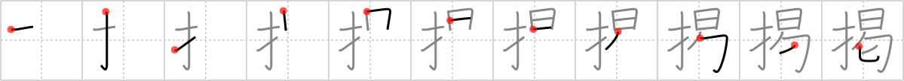

# {掲}

## Strokes: 11

## Reading:

### On-Yomi: ケイ &mdash; Kun-Yomi: かか.げる

### Examples: 掲げる (かか.げる)

## Words:

掲げる(かかげる): to publish, to print, to carry (an article), to put up, to hang out, to hoist, to fly (a sail), to float (a flag)

掲載(けいさい): appearance (e.g. article in paper)

掲示(けいじ): notice, bulletin
