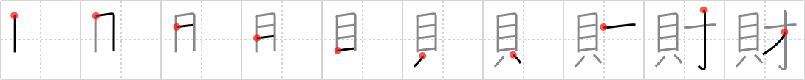

## `property`

## [10]

## Reading:

### On-Yomi: ザイ、サイ、ゾク &mdash; Kun-Yomi: たから

### Examples: 財産 (ざいさん), 私財 (しざい), 文化財 (ぶんかざい)

## Words:

財(ざい): fortune, riches

財源(ざいげん): source of funds, resources, finances

財政(ざいせい): economy, financial affairs

文化財(ぶんかざい): cultural assets, cultural property

財産(ざいさん): property, fortune, assets

財布(さいふ): purse, wallet

## Koohii stories:

1) [<a href="http://kanji.koohii.com/profile/dwhitman">dwhitman</a>] 31-10-2007(257): If you&#039;re a <em>money genius</em>, you can afford a lot of<strong> property</strong>. 

2) [<a href="http://kanji.koohii.com/profile/fuaburisu">fuaburisu</a>] 13-10-2005(116): The keyword refers to<strong> property</strong> in the sense of money or funds rather than of buildings or real estate. Keep this one distinct from frame 193 (“wealth”) and frame 473 (“assets”). Here we have a genie, gulping down oysters. Someone tries to grab an oyster and the genie puts his big arms around his oysters and states his “right of ownership” : “They&#039;re mines, my<strong> property</strong>!”. 

3) [<a href="http://kanji.koohii.com/profile/Harrow">Harrow</a>] 23-11-2008(81): <strong>Property</strong> comes in several forms, shells (money) and intellectual<strong> property</strong> (genius). 

4) [<a href="http://kanji.koohii.com/profile/Istvan">Istvan</a>] 21-6-2007(17): A genius with money LEFT over buys<strong> property</strong>. 

5) [<a href="http://kanji.koohii.com/profile/xxinde">xxinde</a>] 8-10-2009(15): To gain a lot of<strong> property</strong>, you need either a <em>genie</em> or to be a <em>genius</em>. The <em>clam</em> is there to emphasize that this character is more about financial<strong> property</strong> or funds than real estate. 

6) [<a href="http://kanji.koohii.com/profile/Beneus">Beneus</a>] 28-2-2008(11): A man finds a <em>genie</em> who fulfills one wish. The man wishes for all the <em>money</em> in the world to become his<strong> property</strong>. But the genie of course twists his words: The money is his<strong> property</strong>, but it&#039;s still kept by others, in wallets and banks, and THEY don&#039;t know it&#039;s his<strong> property</strong>. This shows how difficult the concept of<strong> property</strong> can be (think intellectual properties if it helps you.). 

7) [<a href="http://kanji.koohii.com/profile/torida">torida</a>] 26-5-2010(9): I paid good money for you genie! You&#039;re my<strong> property</strong> now! 

8) [<a href="http://kanji.koohii.com/profile/mikedough2">mikedough2</a>] 29-3-2008(6): This <em>genie</em> found on the shore inside of a <em>clam</em> specializes in real-estate and can get you a great deal on some waterfront<strong> property</strong>. 

9) [<a href="http://kanji.koohii.com/profile/punta">punta</a>] 14-3-2012(4): I have no money. My only<strong> property</strong> is genius. 

10) [<a href="http://kanji.koohii.com/profile/dmichaud">dmichaud</a>] 30-4-2012(3): Notre propriété se résume finalement à 2 choses : Matériel Symbolisé par <em>l&#039;argent</em> et immateriel symbolisé par notre <em>génie</em>, savoir et savoir-faire. 
