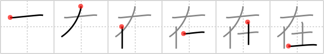

## `exist`

## [6]

## Reading:

### On-Yomi: ザイ &mdash; Kun-Yomi: あ.る

### Examples: 在る (あ.る)

## Words:

健在(けんざい): in good health, well

在庫(ざいこ): stockpile, stock

自在(じざい): freely, at will

所在(しょざい): whereabouts

不在(ふざい): absence

在る(ある): to live, to be

現在(げんざい): present, up to now, nowadays, modern times, current

在学(ざいがく): (enrolled) in school

存在(そんざい): existence, being

滞在(たいざい): stay, sojourn

## Koohii stories:

1) [<a href="http://kanji.koohii.com/profile/nolusu">nolusu</a>] 24-7-2007(276): Genie in the bottle does<strong> exist</strong> but you need to dig deep into the soil to find one. 

2) [<a href="http://kanji.koohii.com/profile/nest0r">nest0r</a>] 24-1-2008(66): You wipe the <em>soil</em> from the bottle, only to have a genie float out above you, saying: &#039;I am the <em>genie in a bottle</em>, what is your wish?&#039; So now you know that they do<strong> exist</strong>. 

3) [<a href="http://kanji.koohii.com/profile/rizzo">rizzo</a>] 13-3-2006(46): Genies don&#039;t<strong> exist</strong>! If you open the <em>&quot;genie in a bottle&quot;</em> you&#039;ll find nothing but <em>soil</em>. 

4) [<a href="http://kanji.koohii.com/profile/Danieru">Danieru</a>] 2-6-2008(22): Only one extra stroke separates this from <a href="../152">pressure</a> (#152 <a href="http://jisho.org/kanji/details/圧">圧</a>). // If <em>genies</em> do<strong> EXIST</strong> in bottles, they must certainly be crammed in them under extreme pressure (  <a href="http://jisho.org/kanji/details/圧">圧</a>  ). If you really want to make sure that they do<strong> exist</strong>, be sure to clean the <em>dirt</em> off the lamp and give it an &#039;extra stroke&#039; to find out! 

5) [<a href="http://kanji.koohii.com/profile/blackstockc">blackstockc</a>] 14-10-2007(18): When Aladin discovered the <em>magic bottle</em>, he rubbed it and nothing happened. He then concluded that genies did not<strong> exist</strong>. However, upon arriving home, he saw that the spout was filled with <em>soil</em>. After cleaning the bottle the genie emerged and disperesed the skeptical Aladin&#039;s doubts. 

6) [<a href="http://kanji.koohii.com/profile/Tornadic_Indignation">Tornadic_Indignation</a>] 4-5-2009(13): &quot;I swear! The <em>genie in a bottle</em> does<strong> exist</strong>! You just have to keep digging in the <em>soil</em>, and digging, and... digging..... in the <em>soil</em> ... and........... digging...................... and...................... digging....................................... and................................................ DIGGING........................................................... AND............................. what was I looking for again?&quot;. 

7) [<a href="http://kanji.koohii.com/profile/PCP812">PCP812</a>] 6-8-2012(6): The <em>genie bottle</em><strong> exist</strong>s, buried deep in the <em>soil</em>. 

8) [<a href="http://kanji.koohii.com/profile/DavidZ">DavidZ</a>] 1-8-2009(6): Kafka the <strong>existentialist</strong> finds a bottle, rubs it, and <em>Jeannie</em> appears. &quot;Master, your wish is my command. What do you desire? I will grant you anything you ask for!&quot; says the voluptuous Jeannie, eager and dripping with double entendre. Kafka replies, &quot;The universe is absurd and man&#039;s <strong>existence</strong> has no meaning. You might just as well grant me a mound of <em>dirt</em>&quot;...   <a href="http://jisho.org/kanji/details/存在">存在</a>  [そんざい]  <a href="http://jisho.org/kanji/details/、在る">、在る</a>  [ある]. 

9) [<a href="http://kanji.koohii.com/profile/slats70">slats70</a>] 4-11-2008(6): I used to believe that a <em>Genie in a bottle</em> could<strong> exist</strong> but when I went searching all I found was bottles full of <em>dirt</em>. 

10) [<a href="http://kanji.koohii.com/profile/RobMow">RobMow</a>] 25-8-2008(5): A <em>genie</em> confined <em>to a bottle</em> is condemned to<strong> exist</strong> in his own <em>soil</em>...Kind of like goldfish when you don&#039;t clean out the tank regularly. 
