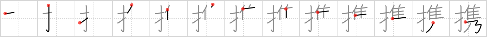

# {687}

## `portable`

## [13]

## Reading:

### On-Yomi: ケイ &mdash; Kun-Yomi: たずさ.える、たずさ.わる

### Examples: 携える (たずさ.える), 携わる (たずさ.わる)

## Words:

携帯(けいたい): carrying something

携わる(たずさわる): to participate, to take part

提携(ていけい): cooperation, tie-up, joint business, link-up
