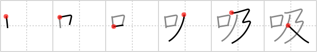

## `suck`

## [6]

## Reading:

### On-Yomi: キュウ &mdash; Kun-Yomi: す.う

### Examples: 吸う (す.う)

## Words:

吸収(きゅうしゅう): absorption, suction, attraction

呼吸(こきゅう): breath, respiration, knack, trick, secret (of doing something)

吸う(すう): to smoke, breathe in, sip, suck

## Koohii stories:

1) [<a href="http://kanji.koohii.com/profile/fuaburisu">fuaburisu</a>] 22-1-2006(174): An <em>open mouth</em> and <em>reaching hands</em> : a baby wants to<strong> suck</strong> at his mother&#039;s breast. 

2) [<a href="http://kanji.koohii.com/profile/chamcham">chamcham</a>] 24-2-2007(142): Imagine a baby reaching out and holding mom&#039;s breast as if it were bottle, and<strong> suck</strong>ing on it to get some milk. 

3) [<a href="http://kanji.koohii.com/profile/Danieru">Danieru</a>] 3-6-2008(54): It&#039;s a terrible image, but I see a baby <em>reaching out</em> to her mother&#039;s breasts, wanting to<strong> suck</strong>le some milk with her <em>mouth</em>. Meanwhile, her mother is<strong> suck</strong>ing back on a cig with total disregard to her child&#039;s health. / Thanks Proxx: This is also the kanji for すう (  <a href="http://jisho.org/kanji/details/吸う">吸う</a>  ), used for &quot;to smoke [a cigarette]&quot;. 

4) [<a href="http://kanji.koohii.com/profile/jwy2k2">jwy2k2</a>] 2-4-2007(40): Reach out and<strong> suck</strong> someone. 

5) [<a href="http://kanji.koohii.com/profile/nilfisq">nilfisq</a>] 30-8-2007(27): To<strong> suck</strong>: open your <em>mouth</em> and <em>reach out</em> for you-know-what... (see also <a href="../690">handle</a> (#690 <a href="http://jisho.org/kanji/details/扱">扱</a>)). 

6) [<a href="http://kanji.koohii.com/profile/Perry">Perry</a>] 26-2-2009(14): Warning, rudeness implied: How can I<strong> SUCK</strong> it when it doesn&#039;t REACH my MOUTH? 

7) [<a href="http://kanji.koohii.com/profile/Boeso">Boeso</a>] 13-4-2008(10): Another Potter story. Imagine the Dementors coming to<strong> SUCK</strong> the life out of you with OPEN MOUTH and OUTSTRETCHED ARMS. 

8) [<a href="http://kanji.koohii.com/profile/Proxx">Proxx</a>] 19-3-2008(10): This is the kanji for すう (  <a href="http://jisho.org/kanji/details/吸う">吸う</a>  ), used for &quot;to smoke [a cigarette]&quot;. Imagine somebody trying to quit smoking. Soon he will be running with <em>outstreched hands</em> through his house looking for something he can<strong> suck</strong> with his <em>mouth</em> (a dummy, a pen, a lollipop, ...). 

9) [<a href="http://kanji.koohii.com/profile/meiko452">meiko452</a>] 27-9-2010(6): Men and babies are the same, MOUTHS open, OUT STRETCHED HANDS, searching for a breast to<strong> suck</strong>. 

10) [<a href="http://kanji.koohii.com/profile/ashman63">ashman63</a>] 19-4-2008(6): (.)(.) A baby with its <em>open mouth</em> <em>reaches out</em> to<strong> suck</strong> milk from these breasts. 
