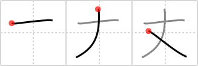

# {丈}

## `length`

## Strokes: 3

## Reading:

### On-Yomi: ジョウ &mdash; Kun-Yomi: たけ、だけ

### Examples: 丈 (たけ)

## Words:

頑丈(がんじょう): solid, firm, stout, burly, strong, sturdy

丈夫(じょうふ): hero, gentleman, warrior, manly person, good health, robustness, strong, solid, durable

丈(たけ): height, stature, length, measure, all (one has)

丈(だけ): only, just, as

成る丈(なるたけ): as much as possible, if possible

丈夫(じょうぶ): good health, robustness, strong, solid, durable, hero, gentleman, warrior, manly person

大丈夫(だいじょうぶ): safe, all right, O.K.
