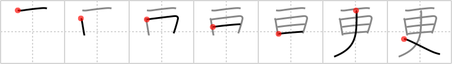

## `grow late`

## [7]

## Reading:

### On-Yomi: コウ &mdash; Kun-Yomi: さら、さら.に、ふ.ける、ふ.かす

## Heisig V6:

The implication behind the meaning of <b>grow late</b> is that things are changing in the same way that the day turns into night. The elements: <i>ceiling</i> . . . <i>sun</i> . . . <i>tucked under the arm</i>.

## Koohii stories:

1) [<a href="http://kanji.koohii.com/profile/perfecturbo">perfecturbo</a>] 28-6-2006(235): It&#039;s starting to<strong> GROW LATE</strong>, so God will take the SUN, and TUCK IT UNDER HIS ARM, and walk away. In the morning, he&#039;ll bring it back, so don&#039;t worry.

2) [<a href="http://kanji.koohii.com/profile/nolusu">nolusu</a>] 24-7-2007(106): At <a href="../30">nightbreak</a> (#30 旦) the sun rises above the floor, so it is logical that when it is growing late, the sun would rise to the ceiling. Time to pack up your things and take your belongings under your arm.

3) [<a href="http://kanji.koohii.com/profile/meolox">meolox</a>] 24-11-2007(78): I keep <em>one sun tucked under my arm</em> for light when it grows late.

4) [<a href="http://kanji.koohii.com/profile/rizzo">rizzo</a>] 27-10-2005(29): As it begins to<strong> grow late</strong> the <em>sun</em> projects the shadow of my <em>arm</em> on the <em>ceiling</em>.

5) [<a href="http://kanji.koohii.com/profile/uberclimber">uberclimber</a>] 2-3-2011(27): When it is <strong>growing late</strong>, the <em>sun</em> sinks below the <em>floor</em>. Time to tuck your belongings <em>under your arm</em> and head home. 更ける (ふける) : get late, advance, wear on; 更に (さらに) : furthermore, again, after all, more and more, moreover; 変更 (へんこう) : change, modification, alteration; 夜更け (よふけ) : late at night.

6) [<a href="http://kanji.koohii.com/profile/zodiac">zodiac</a>] 9-11-2008(23): What happens when it <strong>grows late</strong>? From the <em>ceiling</em>, God <em>tucks the sun under his arm</em> (you can see it in the kanji, the ceiling, the arm, the sun under it).

7) [<a href="http://kanji.koohii.com/profile/zer0range">zer0range</a>] 29-3-2009(15): When it grows late, it&#039;s almost like the sky is tucking the sun under it&#039;s arm.

8) [<a href="http://kanji.koohii.com/profile/KaitouJS">KaitouJS</a>] 25-7-2009(10): It&#039;s starting to <strong>GROW LATE</strong>, so God will take the <em>SUN</em>, and <em>TUCK IT UNDER HIS ARM</em>, and walk away. In the morning, he&#039;ll bring it back, so don&#039;t worry. (Hint: One thing that helped with perfecturbo&#039;s story here is actually seeing the ceiling as the horizon - so when god tucks the sun under his arm and leaves because it has grown late, he has actually gone beyond the horizon, which is technically UNDER it. It symbolizes what the sun does when night comes, so it makes the image a bit stronger.).

9) [<a href="http://kanji.koohii.com/profile/jbudding">jbudding</a>] 11-2-2013(6): It begins to<strong> GROW LATE</strong> as the <em>sun</em> drops from the <em>ceiling</em> of the sky and is <em>tucked under the arm</em> of the horizon.

10) [<a href="http://kanji.koohii.com/profile/natemb">natemb</a>] 27-4-2010(6): <strong>Growing late</strong> is the oposite of <a href="../30">nightbreak</a> (#30 旦). In fact, it&#039;s as if the <a href="../30">nightbreak</a> (#30 旦) has been turned upside down and <em>tucked under one&#039;s arm</em> to put away for the next morning!
