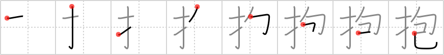

## `embrace`

## [8]

## Reading:

### On-Yomi: ホウ &mdash; Kun-Yomi: だ.く、いだ.く、かか.える

## Heisig story:

Fingers . . . wrap.

## Koohii stories:

1) [<a href="http://kanji.koohii.com/profile/raulir">raulir</a>] 28-4-2006(214): When embracing someone, wrap your fingers around her butt for added effect. You may think of &quot;bound with snakes&quot; as a description of the fingers slithering around the buttocks, if you want a particularly graphic image.

2) [<a href="http://kanji.koohii.com/profile/Nukemarine">Nukemarine</a>] 3-10-2007(64): Here, I&#039;m picturing that scene from ET (the extra terrestrial), where ET hugs Elliot before leaving. You see that<strong> EMBRACE</strong> is ET&#039;s long FINGERS that WRAP around Elliot.

3) [<a href="http://kanji.koohii.com/profile/Kurisu">Kurisu</a>] 14-4-2008(41): Ladies; for a truly intimate <strong>embrace</strong> your <em>fingers</em> should be <em>wrapped</em> around your man&#039;s....imagine <em>binding</em> his <em>snake</em> with your fingers.

4) [<a href="http://kanji.koohii.com/profile/Peppi">Peppi</a>] 21-10-2009(34): King Kong&#039;s way to <strong>embrace</strong> Ann Darrow (the blond beauty) is to <em>wrap</em> his <em>fingers</em> around her. He is too huge to<strong> embrace</strong> her like everybody else.

5) [<a href="http://kanji.koohii.com/profile/synewave">synewave</a>] 7-8-2006(16): From 風の谷のナウシカ . Nausicaa is<strong> embrace</strong>d by the Ohm&#039;s <em>finger</em> like tenticles. The effect is very similar to raulir&#039;s &quot;bound with snakes&quot; image.

6) [<a href="http://kanji.koohii.com/profile/smithsonian">smithsonian</a>] 5-4-2007(9): Even though they have no <em>fingers</em>, snakes can <em>wrap</em> around each other as an<strong> embrace</strong> of love.

7) [<a href="http://kanji.koohii.com/profile/Raichu">Raichu</a>] 14-1-2006(9): Wrap your hands about someone.

8) [<a href="http://kanji.koohii.com/profile/sethg">sethg</a>] 26-3-2009(6): The closest the Japanse come to an<strong> embrace</strong> is <em>wrap</em>ping their <em>fingers</em> around one another&#039;s in a handshake.

9) [<a href="http://kanji.koohii.com/profile/kanjihito">kanjihito</a>] 1-6-2012(4): <em>fingers</em> <em>wrapped</em> in an<strong> embrace</strong>. (Don&#039;t confuse with <a href="../1387">hug</a> (#1387 擁)).

10) [<a href="http://kanji.koohii.com/profile/terozen">terozen</a>] 25-3-2012(4): When <strong>embracing</strong> a girl from behind, I always feel the urge to have my <em>fingers</em> <em>wrapped</em> around her ... <em>ahem</em> ... waist.
