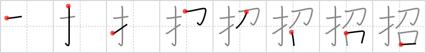

## `beckon`

## [8]

## Reading:

### On-Yomi: ショウ &mdash; Kun-Yomi: まね.く

## Heisig story:

Finger . . . seduce.

## Koohii stories:

1) [<a href="http://kanji.koohii.com/profile/fuaburisu">fuaburisu</a>] 11-10-2005(204): A Geisha<strong> beckon</strong>s you with her index <em>finger</em>, and as you approach she runs her <em>fingers</em> all over her body in an attempt to <em>seduce</em> you. Keyword meaning : “invite”.

2) [<a href="http://kanji.koohii.com/profile/Ricardo">Ricardo</a>] 2-6-2006(90): I bet you all know the Maneki Neko, or <strong>beckon</strong>ing cat, who with its raised <em>fingers</em> tries to <em>seduce</em> all good things (success, happiness and harmony) to its owner.

3) [<a href="http://kanji.koohii.com/profile/Wizard">Wizard</a>] 24-6-2008(47): The siren gently <strong>beckons</strong> you with her <em>finger</em> and <em>seduces</em> you to to your death.

4) [<a href="http://kanji.koohii.com/profile/crystalcastlecreature">crystalcastlecreature</a>] 18-11-2008(22): This kanji actually means <strong>invite</strong>. A FINGER SEDUCTION is in fact an <strong>invitation</strong> for other things. Oh ho ho..... grrrr...

5) [<a href="http://kanji.koohii.com/profile/Kurisu">Kurisu</a>] 8-5-2008(13): She/He <strong>beckoned</strong> me with her <em>finger</em>, <em>seductively</em>.

6) [<a href="http://kanji.koohii.com/profile/Tzadeck">Tzadeck</a>] 11-4-2009(12): Imagine a pretty lady curling her <em>finger</em> to<strong> beckon</strong> you over--the first part of her <em>seduction</em>.

7) [<a href="http://kanji.koohii.com/profile/kanjidummy">kanjidummy</a>] 15-9-2010(8): Using her <em>finger seductively</em> she tried to<strong> beckon</strong> him over.

8) [<a href="http://kanji.koohii.com/profile/hornlo">hornlo</a>] 29-9-2010(4): [ <strong>beckon</strong> = <em>finger</em> + <em>seduce</em> ] - she <strong>beckon</strong>ed me with her <em>finger</em>, with a <em>seductive</em> look in her eye; cf <a href="../v4/86">seduce</a> (#86 召), <a href="../v4/282">urge</a> (#282 迫), <a href="../v4/864">persuade</a> (#864 勧), <a href="../v4/866">encourage</a> (#866 励), <a href="../v4/916">entice</a> (#916 誘).

9) [<a href="http://kanji.koohii.com/profile/koohiikun">koohiikun</a>] 22-10-2008(4): When<strong> beckon</strong>ed by an inviting <em>finger</em>, one is easily <em>seduced</em>.

10) [<a href="http://kanji.koohii.com/profile/j0k0m0">j0k0m0</a>] 1-1-2011(3): Finger seduce (on and kun readings- SHOW me the MONEY(sort of))(しょう me the まね） 招待 (しょうたい) invitation 招く (まねく) to invite 招き (まねき) invitation.

### {V4: 650, V6: 702}
