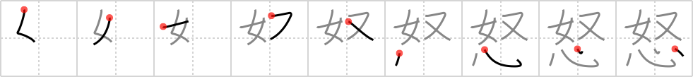

# {怒}

## `angry`

## Strokes: 9

## Reading:

### On-Yomi: ド、ヌ &mdash; Kun-Yomi: いか.る、おこ.る

### Examples: 怒る (いか.る), 怒る (おこ.る)

## Words:

怒り(いかり): anger, hatred

怒る(いかる): to get angry, to be angry

怒鳴る(どなる): to shout, to yell

怒る(おこる): get angry
