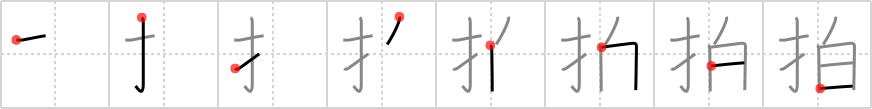

## `clap`

## [8]

## Reading:

### On-Yomi: ハク、ヒョウ

## Heisig story:

Fingers . . . white.

## Koohii stories:

1) [<a href="http://kanji.koohii.com/profile/dingomick">dingomick</a>] 18-2-2007(325): (Image: the most snooty prim and proper English Lord with <em>white</em> gloves<strong> clap</strong>ping only with his <em>fingers</em>. &quot;Oh bravo old chap. Bravo...&quot;).

2) [<a href="http://kanji.koohii.com/profile/AndamanIslander">AndamanIslander</a>] 27-3-2008(131): I<strong> clap</strong>ped so hard, my <em>fingers</em> became <em>white</em>.

3) [<a href="http://kanji.koohii.com/profile/synewave">synewave</a>] 11-7-2006(44): <em>Fingering</em> someone with the<strong> clap</strong>, there is likely to be a lot of <em>white</em> puss in the general area you are working with...(Sorry for that! Fuaburice please feel free to delete this if it breaches any etiquette rules. This story is definitely not from personal experience!).

4) [<a href="http://kanji.koohii.com/profile/SammyB">SammyB</a>] 8-10-2008(16): If your <em>fingers</em> have turned <em>white</em> it is probably time to stop <strong>clapping</strong>.

5) [<a href="http://kanji.koohii.com/profile/Raichu">Raichu</a>] 14-1-2006(16): When you<strong> clap</strong>, the impact pushes the blood out of your hands, leaving them white momentarily.

6) [<a href="http://kanji.koohii.com/profile/jameserb">jameserb</a>] 9-5-2008(13): Fingers making white noise --<strong> clap</strong>ping, of course!

7) [<a href="http://kanji.koohii.com/profile/kodorakun">kodorakun</a>] 27-6-2009(12): For the scientific folk out there: the frequency spectrum of a<strong> clap</strong> (or firecracker) is level, i.e. the fourier spectrum is an even combination of all frequencies -- this is a definition for WHITE NOISE. when you<strong> clap</strong> you make white noise :D.

8) [<a href="http://kanji.koohii.com/profile/gibler">gibler</a>] 12-3-2011(7): When I was a kid I always<strong> clap</strong>ped my fingers hard and then they turned white by the time I was done. 拍手 はくしゅ　＝　Applause.

9) [<a href="http://kanji.koohii.com/profile/FutureBlues">FutureBlues</a>] 5-6-2008(6): Master Hand in Smash Bros <strong>clap</strong>s you to death with his big, <em>white fingers</em>.

10) [<a href="http://kanji.koohii.com/profile/FoxintheStars">FoxintheStars</a>] 8-8-2010(5): I thought of gymnasts helping their <em>fingers</em> slide around the bars with powder that they<strong> clap</strong> off and raise <em>white</em> puffs of---but this kanji also has to do with rhythm, so I imagine an Olympics-time TV commercial with a mashup of footage of gymnasts doing that set to &quot;We Will Rock You.&quot;.
