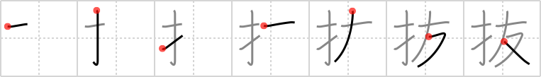

## `slip out`

## [7]

## Reading:

### On-Yomi: バツ、ハツ、ハイ &mdash; Kun-Yomi: ぬ.く、-ぬ.く、ぬ.き、ぬ.ける、ぬ.かす、ぬ.かる

## Koohii stories:

1) [<a href="http://kanji.koohii.com/profile/rizzo">rizzo</a>] 27-10-2005(297): Don&#039;t let good <em>friends</em><strong> slip out</strong> between your <em>fingers</em>. 

2) [<a href="http://kanji.koohii.com/profile/RoboTact">RoboTact</a>] 19-5-2007(146): Imagine a cliché Hollywood situation: one person is lying on the edge of the abyss and another (presumably his <em>friend</em>) is hanging, only thing holding him is the grip of their hands. Then <em>fingers</em> <strong>slip out</strong> of the grip and he falls in said abyss. 

3) [<a href="http://kanji.koohii.com/profile/AndamanIslander">AndamanIslander</a>] 11-4-2008(89): The only stories I can think of here are really aggressively pornographic, so maybe I should just say nothing. 

4) [<a href="http://kanji.koohii.com/profile/tcjeff">tcjeff</a>] 10-6-2008(51): &quot;I want to <em>finger</em> my <em>friend</em>!&quot; The words just <strong>slipped out</strong>. That&#039;s the last time I play truth or dare while drunk. 

5) [<a href="http://kanji.koohii.com/profile/kansaigaijin">kansaigaijin</a>] 3-2-2009(23): My <em>finger</em>s <strong>slipped out</strong> of my <em>friend</em> and I knew we were past the friend&#039;s stage at that moment. 

6) [<a href="http://kanji.koohii.com/profile/eightyd">eightyd</a>] 2-11-2009(13): When I&#039;m with my friends, sometimes I put my hand down my pants and stick my finger out my fly. &quot;OMG IT SLIPPED OUT!,&quot; I yell... everyone always laughs. 

7) [<a href="http://kanji.koohii.com/profile/j0k0m0">j0k0m0</a>] 21-8-2011(10): Jeeze, with my wife&#039;s sister again (  <a href="http://jisho.org/kanji/details/友子">友子</a>   Tomoko), my fingers<strong> slip out</strong>. and in. and out of her clogged kitchen drain, which I am trying to fix.... (reporters! If you only knew the agony i go through.). 

8) [<a href="http://kanji.koohii.com/profile/astgtciv">astgtciv</a>] 11-1-2007(10): <em>Fingers the Thief</em> is holding on to his <em>friend</em> Dillinger by his fingers only on the side of the building during an escape from prizon. &quot;Forget it, Fingers.&quot;, whispers Dillinger, and his fingers<strong> slip out</strong> of <em>Fingers&#039; fingers</em>. &quot;Nooooooooo!&quot; shouts Fingers and starts to cry. The film is called &quot;<em>Friend of Fingers</em>&quot;. 

9) [<a href="http://kanji.koohii.com/profile/aburameshina">aburameshina</a>] 30-9-2012(6): Her <em>fingers</em> <strong>slipped out</strong> of mine as she said, &#039;I think we should just be <em>friends</em>...&#039;. 

10) [<a href="http://kanji.koohii.com/profile/Benzhi">Benzhi</a>] 28-11-2008(6): Princess Leia: &quot;The more you tighten your grip, Vader, the more friendly star systems will<strong> slip out</strong> of your fingers.&quot;. 
