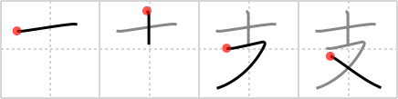

## `branch`

## [4]

## Reading:

### On-Yomi: シ &mdash; Kun-Yomi: ささ.える、つか.える、か.う、しんよう、じゅうまた

## Heisig story:

Needle . . . crotch.

## Koohii stories:

1) [<a href="http://kanji.koohii.com/profile/Johnnyltn">Johnnyltn</a>] 16-8-2006(269): Picture sliding down the<strong> branch</strong> of a tree (in this case a pine tree or any tree with <em>needles</em>) and getting a bunch of <em>needles</em> stuck in your <em>crotch</em>--ouch!!

2) [<a href="http://kanji.koohii.com/profile/mikedough2">mikedough2</a>] 26-11-2007(69): A special<strong> branch</strong> of the military called the <em>Needle Crotch</em> Unit. Their only weapon is the <em>needle</em> embedded in their <em>crotches</em>, and they&#039;re quite adept at using them.

3) [<a href="http://kanji.koohii.com/profile/Danieru">Danieru</a>] 6-6-2008(50): Sitting on the<strong> BRANCH</strong> of a coniferous tree, getting sharp <em>needles</em> in my <em>crotch</em>. (Remember there is no tree radical in this kanji, whereas <a href="../713">bough</a> (#713 枝) ( 枝 ) does because a &quot;bough&quot; is a main part of the tree, whereas this kanji refers to a smaller<strong> branch</strong>. It can also be used to refer to the<strong> branch</strong> of a store ( 支店 ) which also has nothing to do with a tree).

4) [<a href="http://kanji.koohii.com/profile/faded">faded</a>] 14-12-2009(22): I have a 10 inch<strong> branch</strong> coming out of my crotch.

5) [<a href="http://kanji.koohii.com/profile/MeisterLlama">MeisterLlama</a>] 29-11-2008(21): I would try to steer away from using tree imagery for this kanji: 支 (branch) is not actually used for tree<strong> branch</strong>es, but rather for conceptual<strong> branch</strong>es, like a store<strong> branch</strong> ( 支店 ). 枝 (bough), on the other hand, is an actual <em>branch</em> from a <em>tree</em>.

6) [<a href="http://kanji.koohii.com/profile/Odieone">Odieone</a>] 19-11-2008(15): That<strong> branch</strong> charged me <strong>ten</strong> dollars <strong>again</strong>.

7) [<a href="http://kanji.koohii.com/profile/xxinde">xxinde</a>] 8-10-2009(13): Here&#039;s one for you: how many<strong> branch</strong>es will a tree have if it has <em>ten</em> <em>crotches</em>?

8) [<a href="http://kanji.koohii.com/profile/koohiikun">koohiikun</a>] 3-11-2008(11): The<strong> branch</strong> of the hospital doing sex changes does most of its surgery using <em>needles</em> on the <em>crotch</em>.

9) [<a href="http://kanji.koohii.com/profile/marcus">marcus</a>] 12-8-2008(9): A gentleman&#039;s crotch can create<strong> branch</strong>es on a family tree. With a woman, of course. SHI has just as much responsibility as he.

10) [<a href="http://kanji.koohii.com/profile/ziggr">ziggr</a>] 24-5-2007(8): You go to your local bank <strong>branch</strong>, where a truly diabolical ATM machine, instead of spitting out twenties, spits <em>needles</em> right into your <em>crotch</em>. Don&#039;t forget your receipt! (I wanted a story that didn&#039;t incorporate any trees, since the kanji didn&#039;t).
