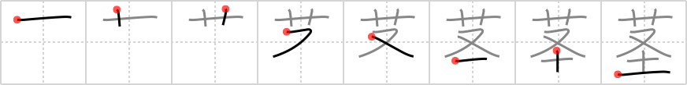

## `stalk`

## [8]

## Reading:

### On-Yomi: ケイ、キョウ &mdash; Kun-Yomi: くき

## Heisig V6:

Flower . . . spool.

## Premitive V4:

spool Here we see a simplified drawing of a spool (the element for earth at the bottom) with threads being wound about it tightly (the crotch at the top). You may remember it either pictographically or by way of the primitives. [5]

## Koohii stories:

1) [<a href="http://kanji.koohii.com/profile/Katsuo">Katsuo</a>] 18-2-2008(196): Suggestion: Replace &quot;spool&quot; with &quot;toilet paper/roll&quot;. Reasons: (1) <em>Toilet paper/roll</em> usually comes on a <em>spool</em>. (2) <em>Toilet paper</em> is used to clean the <em>soil</em> off your <em>crotch</em>. Story: Just get a <em>flower</em> and carefully wrap some <em>toilet paper</em> around its<strong> stalk</strong>. Spool also appears in <a href="../716">suspicious</a> (#716 怪), <a href="../717">lightly</a> (#717 軽), <a href="../882">diameter</a> (#882 径), <a href="../1360">sutra</a> (#1360 経).

2) [<a href="http://kanji.koohii.com/profile/dingomick">dingomick</a>] 9-8-2007(130): PRIMITIVE: <em>soiled crotch</em> = <em>soiled underwear</em>. To precent anyone from picking the beautiful <em>flower</em>, the gardner hung <em>soiled underwear</em> on the <strong>stalk</strong>.

3) [<a href="http://kanji.koohii.com/profile/nac_est">nac_est</a>] 24-7-2007(83): A <em>flower</em>&#039;s<strong> stalk</strong> can be seen as connecting the <em>flower</em> to the <em>soil</em>, <em>or again</em> the <em>soil</em> to the <em>flower</em>. It depends on how you look at it.

4) [<a href="http://kanji.koohii.com/profile/uberclimber">uberclimber</a>] 15-10-2010(62): Jack and the Bean<strong>stalk</strong>: <em>dirt</em> below, <em>flowers</em> above, and Jack&#039;s <em>crotch</em> visible as he climbs up and up. 茎 (くき) :<strong> stalk</strong>.

5) [<a href="http://kanji.koohii.com/profile/ihatobu">ihatobu</a>] 16-9-2007(30): Flowering vines growing up a post or column. The<strong> stalk</strong>s wrap around the post-- again and again-- like a <em>spool </em>of thread, and <em>flowers</em> bloom at the very top. At the bottom, of course, is the soil.

6) [<a href="http://kanji.koohii.com/profile/fuaburisu">fuaburisu</a>] 14-10-2005(29): A very odd <em>flower</em> we have here, with a<strong> stalk</strong> (stem) so long, it curls round and round like a <em>spoo</em>l.

7) [<a href="http://kanji.koohii.com/profile/Clint">Clint</a>] 29-5-2008(21): A clever way to<strong> stalk</strong> someone: give them a beautiful <em>flower</em> with a <em>spool</em> of thread attached (to the<strong> stalk</strong>, of course!) so that as they walk, the <em>spool</em> slowly unwinds, leaving a trail of thread behind. Then, no matter where they go, you can simply follow the thread to wherever they are! Muahaha!

8) [<a href="http://kanji.koohii.com/profile/KeroHazel">KeroHazel</a>] 11-2-2009(11): The &quot;Jack and the Beanstalk&quot; references are great, but if you&#039;re a gamer I have something even better. Think Super Mario Bros. 2! Look at it as a pictograph. The <em>flower</em> is the top of a climbable vine. The <em>crotch</em> is the legs of your character. The bottom part is not soil but the bottom half of <em>ivy</em> - the top half is obscured by your character. Sing the music for the first level of this game when you study, and I guarantee you will never forget this one!

9) [<a href="http://kanji.koohii.com/profile/blackstockc">blackstockc</a>] 29-10-2007(9): The <strong>stalk</strong>er took the<strong><strong> stalk</strong></strong>ee&#039;s <em>soiled underwear</em> and put them to his face, smelling them as he would smell a handful of <em>flower</em>s.

10) [<a href="http://kanji.koohii.com/profile/TalkTalk">TalkTalk</a>] 4-8-2009(6): Between its <em>flower</em> and the <em>soil</em> is the<strong> stalk</strong> (a/k/a the plant&#039;s <em>crotch</em>).
