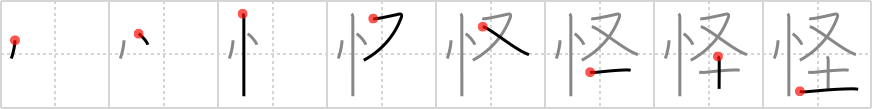

## {716}

## `suspicious`

## [8]

## Reading:

### On-Yomi: カイ、ケ &mdash; Kun-Yomi: あや.しい、あや.しむ

### Examples: 怪しい (あや.しい), 怪しむ (あや.しむ)

## Words:

怪獣(かいじゅう): monster

怪我(けが): injury, get hurt, be injured

怪しい(あやしい): suspicious, doubtful
