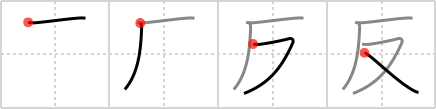

## {722}

## `anti-`

## [4]

## Reading:

### On-Yomi: ハン、ホン、タン、ホ &mdash; Kun-Yomi: そ.る、そ.らす、かえ.す、かえ.る、-かえ.る

### Examples: 反映 (はんえい), 反対 (はんたい), 違反 (いはん), 謀反 (むほん), 反らす (そ.らす), 反る (そ.る)

## Words:

反り(そり): warp, curvature, curve, arch

反(たん): roll of cloth (c. 10 yds.), .245 acres, 300 tsubo

反感(はんかん): antipathy, revolt, animosity

反響(はんきょう): echo, reverberation, repercussion, reaction, influence

反撃(はんげき): counterattack, counteroffensive, counterblow

反射(はんしゃ): reflection, reverberation

反する(はんする): to be inconsistent with, to oppose, to contradict, to transgress, to rebel

反応(はんのう): reaction, response

反発(はんぱつ): repelling, rebound, recover, oppose

反乱(はんらん): insurrection, mutiny, rebellion, revolt, uprising

違反(いはん): violation (of law), transgression

反る(かえる): change, turn over, turn upside down

反映(はんえい): reflection, influence

反抗(はんこう): opposition, resistance, insubordination, defiance, hostility, rebellion

反省(はんせい): reflection, reconsideration, introspection, meditation, contemplation

反対(はんたい): oppose
