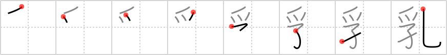

## `milk`

## [8]

## Reading:

### On-Yomi: ニュウ &mdash; Kun-Yomi: ちち、ち

## Koohii stories:

1) [<a href="http://kanji.koohii.com/profile/fuaburisu">fuaburisu</a>] 28-10-2005(315): A <em>fledgling</em> is being nursed at a zoo, it is fed<strong> milk</strong> through a small tube that is bent in the shape of a <em>hook</em> (so that it fits inside its beak). The <em>fledgling</em> soon becomes addicted to<strong> milk</strong>, giving us this very catchy mnemonic: “<em>fledgling hooked</em> on<strong> milk</strong>”. 

2) [<a href="http://kanji.koohii.com/profile/stehr">stehr</a>] 1-10-2007(67): Drinking<strong> milk</strong> not only reduces <a href="../96">cavity</a> (#96 <a href="http://jisho.org/kanji/details/孔">孔</a>)&#039;s but also strengthens <em>nails</em> (claws) thanks astgtciv. 

3) [<a href="http://kanji.koohii.com/profile/TunS77">TunS77</a>] 27-9-2008(50): This <em>fledgling</em> is <em>hooked</em> on<strong> MILK</strong>.. better than booze I suppose... 

4) [<a href="http://kanji.koohii.com/profile/astgtciv">astgtciv</a>] 11-1-2007(22): This is very similar to <a href="../96">cavity</a> (#96 <a href="http://jisho.org/kanji/details/孔">孔</a>) (&quot;Drink<strong> milk</strong>, it reduces cavities!&quot;, says the dentist). The only difference is that the child here is a <em>baby eagle</em>, a fledgling. 

5) [<a href="http://kanji.koohii.com/profile/uberclimber">uberclimber</a>] 1-3-2011(19): As a <em>child</em>, <em>Wolverine</em> became <em>hook</em>ed on<strong> milk</strong>...and that&#039;s how he grew those claws (excess calcium).   <a href="http://jisho.org/kanji/details/牛乳">牛乳</a>   (ぎゅうにゅう) : cow&#039;s<strong> milk</strong>. 

6) [<a href="http://kanji.koohii.com/profile/Raichu">Raichu</a>] 23-12-2011(5): <strong>Milk</strong> gives a child strong nails (  <a href="http://jisho.org/kanji/details/爪">爪</a>  ) and prevents cavities (  <a href="http://jisho.org/kanji/details/孔">孔</a>  ). 

7) [<a href="http://kanji.koohii.com/profile/shank">shank</a>] 20-12-2009(5): <em>Wolverine</em> had his <em>child</em> <em>hook</em>ed to the <strong>milk</strong> bottle constantly. Not only to prevent <em>cavities</em> but <em>Wolverine</em> knows the importants of strong <em>claws</em>. 

8) [<a href="http://kanji.koohii.com/profile/Flipper">Flipper</a>] 25-8-2011(4): Auch kleine Geier<em>küken</em> brauchen <strong>Milch</strong>, um groß und stark zu werden. Daher kommt auch zu ihnen der <strong>Milch</strong>mann, zumindest so lange sie das Nest noch nicht verlassen können. Da der Lieferant meist nicht fliegen kann, wird der mit <strong>Milch</strong> gefüllte Eimer an einen <em>Haken</em> gehängt, den die Geierfamilie dann ins Nest hochziehen kann. 

9) [<a href="http://kanji.koohii.com/profile/kapalama">kapalama</a>] 6-11-2010(4):   <a href="http://jisho.org/kanji/details/脱脂粉乳">脱脂粉乳</a>  ,   <a href="http://jisho.org/kanji/details/牛乳">牛乳</a>  ,   <a href="http://jisho.org/kanji/details/巨乳">巨乳</a>  ,   <a href="http://jisho.org/kanji/details/爆乳">爆乳</a>   <a href="../729">milk</a> (#729 <a href="http://jisho.org/kanji/details/乳">乳</a>) ニュウ, ちち, ち ... Parts: 孚(⺤,  <a href="http://jisho.org/kanji/details/子">子</a>  ), 乚 ... Note: also means <strong>Breast/nipple</strong> as in   <a href="http://jisho.org/kanji/details/乳首">乳首</a>  . The <em>child hooks</em> onto the Nipple like a <em>vulture</em>, to get<strong> milk</strong>. 

10) [<a href="http://kanji.koohii.com/profile/mantixen">mantixen</a>] 3-7-2009(4): <em>Vultures</em> often get <em>cavities</em> because they don&#039;t drink<strong> milk</strong> to strengthen their teeth. 
