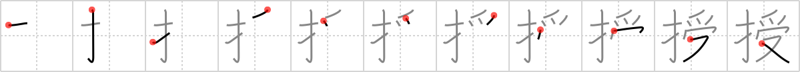

# {授}

## `impart`

## Strokes: 11

## Reading:

### On-Yomi: ジュ &mdash; Kun-Yomi: さず.ける、さず.かる

### Examples: 授かる (さず.かる), 授ける (さず.ける)

## Words:

授ける(さずける): to grant, to award, to teach

教授(きょうじゅ): teaching, instruction, professor

助教授(じょきょうじゅ): assistant professor

授業(じゅぎょう): lesson, class work
