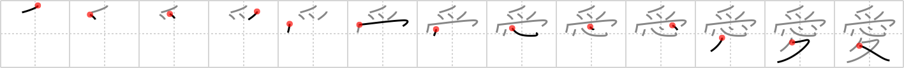

## `love`

## [13]

## Reading:

### On-Yomi: アイ &mdash; Kun-Yomi: いと.しい

## Koohii stories:

1) [<a href="http://kanji.koohii.com/profile/Thunderball">Thunderball</a>] 5-8-2007(263): If you really<strong> love</strong> someone, you won&#039;t keep them in a cage-like <em>bird house</em> relationship, but rather open the door and let their <em>heart</em> <em>walk</em> around freely. Think less about &quot;I&quot; (あい) and more about &quot;we&quot;. 

2) [<a href="http://kanji.koohii.com/profile/szreter">szreter</a>] 17-3-2008(156): The man is about to enter the &#039;<em>birdhouse</em>&#039; (brothel) when he remembers his true <em>love</em> at home, and, following his <em>heart</em>, uses his <em>walking legs</em> to go straight home. 

3) [<a href="http://kanji.koohii.com/profile/samuize">samuize</a>] 17-10-2007(58):   <a href="http://jisho.org/kanji/details/愛は相手の心を受けることです。">愛は相手の心を受けることです。</a>  (I heard that one from a buddhist priest - dont forget the extra stroke). 

4) [<a href="http://kanji.koohii.com/profile/raulir">raulir</a>] 28-4-2006(21): Here we see what the guy from <a href="../616">melancholy</a> (#616 <a href="http://jisho.org/kanji/details/憂">憂</a>) ended up doing. To solve his matters of heart, he turned his walking legs towards the brothel (bird house) seeking for<strong> love</strong>. 

5) [<a href="http://kanji.koohii.com/profile/fuaburisu">fuaburisu</a>] 10-10-2005(19): An overly romantic man carries a bird house all the time with him, so he can send<strong> love</strong>-messages with his pigeons wherever he goes on his walking legs. His heart beating heavily in between the bird house (sitting atop the head like a hat), and the walking legs. 

6) [<a href="http://kanji.koohii.com/profile/Koos83">Koos83</a>] 1-11-2009(11): When I&#039;m in<strong> love</strong>, my HEART feels like a BIRDHOUSE full of fluttering birds, and my WALKING LEGS flutter accordingly. 

7) [<a href="http://kanji.koohii.com/profile/sgrant">sgrant</a>] 29-10-2008(10): Have you heard the sad story of a man who fell in<strong> love</strong> with a hooker at &quot;the <em>Birdhouse</em>&quot;. Unfortunately, she broke his <em>heart</em> and sent him home on his <em>walking legs</em>. 

8) [<a href="http://kanji.koohii.com/profile/aboros">aboros</a>] 19-1-2007(9): Hamlet (see <a href="../616">melancholy</a> (#616 <a href="http://jisho.org/kanji/details/憂">憂</a>)) can&#039;t get any<strong> love</strong> from Ophelia, so he takes his broken <em>heart</em> and his <em>walking legs</em> over to the <em>whorehouse</em> (see <a href="../735">accept</a> (#735 <a href="http://jisho.org/kanji/details/受">受</a>)). 

9) [<a href="http://kanji.koohii.com/profile/AmberBeckett">AmberBeckett</a>] 23-1-2013(5): It&#039;s easy to<strong> love</strong> Professor X. Sharing his MANSION and saving the world all the time. What a good HEART. Pity about the LEGS though.... 

10) [<a href="http://kanji.koohii.com/profile/dusmar84">dusmar84</a>] 29-12-2009(5): If you<strong> love</strong> someone set them free from the <em>(bird) cage</em>. If they<strong> love</strong> you down in their <em>heart</em> they will always come <em>walking</em> back. 
