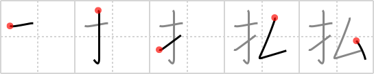

# {払}

## `pay`

## Strokes: 5

## Reading:

### On-Yomi: フツ、ヒツ、ホツ &mdash; Kun-Yomi: はら.う、-はら.い、-ばら.い

### Examples: 払う (はら.う)

## Words:

支払(しはらい): payment

支払う(しはらう): to pay

払い込む(はらいこむ): deposit, pay in

払い戻す(はらいもどす): repay, pay back

酔っ払い(よっぱらい): drunkard

払う(はらう): pay
