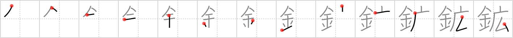

## `mineral`

## [13]

## Reading:

### On-Yomi: コウ &mdash; Kun-Yomi: あらがね

## Heisig V6:

Metal . . . wide.

## Koohii stories:

1) [<a href="http://kanji.koohii.com/profile/daredawg3583">daredawg3583</a>] 2-4-2007(212): <em>Elbonium</em>: a new<strong> mineral</strong> found in <em>wide caves</em> shaped like elbows and made of metal.

2) [<a href="http://kanji.koohii.com/profile/szreter">szreter</a>] 17-3-2008(172): A <em>wide</em> range of <em>metal</em>s are classed as<strong> mineral</strong>s.

3) [<a href="http://kanji.koohii.com/profile/jimsublimeman">jimsublimeman</a>] 19-10-2007(45): You need a <em>wide</em> range of<strong> mineral</strong>s and <em>iron</em> (metal) in your diet to avoid anaemia and other nasty things.

4) [<a href="http://kanji.koohii.com/profile/Raschaverak">Raschaverak</a>] 30-6-2009(38): Imagine some miners mining some<strong> mineral</strong>s, with their metal picks, in a cave, as they mine out more and more<strong> mineral</strong>s, the cave gets wider and wider….

5) [<a href="http://kanji.koohii.com/profile/dsamari">dsamari</a>] 28-10-2007(18): <em>Metal</em> is a general term for a <em>wide</em> range of<strong> mineral</strong>s.

6) [<a href="http://kanji.koohii.com/profile/sgrant">sgrant</a>] 30-10-2008(8): Robin walks in and sees the new <em>widescreen</em>. He grabs himself a<strong> mineral</strong> water from the <em>metallic</em> batfridge and sits down with Batman.

7) [<a href="http://kanji.koohii.com/profile/esaulgd">esaulgd</a>] 15-4-2007(8): For <strong>mineral</strong> exploitation the best are <em>wide</em> caves rife with <em>metals</em> (since miners can&#039;t get into narrow ones).

8) [<a href="http://kanji.koohii.com/profile/CerpinTaxt">CerpinTaxt</a>] 31-10-2009(6): Gold is a part of a wide range of<strong> mineral</strong>s.

9) [<a href="http://kanji.koohii.com/profile/xiaoma">xiaoma</a>] 15-2-2009(6): Unlike <em>gold</em>, which is concentrated in a vein, most<strong> mineral</strong>s are distributed over <em>wide</em> areas.

10) [<a href="http://kanji.koohii.com/profile/Kurisu">Kurisu</a>] 14-5-2008(6): <strong>Minerals</strong> like <em>gold</em> are extracted from <em>caves</em> with lots of <em>elbow grease</em>.
