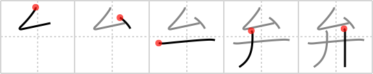

## `valve`

## [5]

## Reading:

### On-Yomi: ベン、ヘン &mdash; Kun-Yomi: わきま.える、わ.ける、はなびら、あらそ.う

## Koohii stories:

1) [<a href="http://kanji.koohii.com/profile/scottamus">scottamus</a>] 1-12-2005(350): Opening a stuck<strong> valve</strong> requires 2 hands and a lot of elbow grease. 

2) [<a href="http://kanji.koohii.com/profile/astgtciv">astgtciv</a>] 20-1-2007(62): The cubans build a pipe to flood the USA. Castro just has to turn the<strong> valve</strong> on it, and USA is flooded. Suddenly, CIA agents tackle him from behind, grabbing both his arms. But <em>Castro</em> manages to open the<strong> valve</strong> with his <em>elbow</em>, by raising the <em>elbow</em> above his head. Success! USA is no more... 

3) [<a href="http://kanji.koohii.com/profile/cangy">cangy</a>] 17-1-2008(55): Opening a stuck<strong> valve</strong> requires 2 hands, and on top of that, a lot of elbow grease. (thanks scottamus). 

4) [<a href="http://kanji.koohii.com/profile/fuaburisu">fuaburisu</a>] 1-1-2006(20): You try to unblock an old rusty<strong> valve</strong> with a hit of the <em>elbow</em>, and then with your <em>two hands</em>, to no avail. 

5) [<a href="http://kanji.koohii.com/profile/Danieru">Danieru</a>] 10-6-2008(17): &quot;She&#039;s stuck real good-like&quot; the guy from the いなか (  <a href="http://jisho.org/kanji/details/田舎">田舎</a>  ; country) said to me with a strong rural <strong>dialect</strong> (  <a href="http://jisho.org/kanji/details/弁">弁</a>  ; べん). &quot;You best grab on ta&#039;er with <em>both hands</em> and giv-er that<strong> VALVE</strong> some <em>elba</em>&#039; greeze.&quot; (I couldn&#039;t resist: this is a favourite Japanese word of mine, which also means &quot;regional dialect.&quot; Such as Osaka-ben   <a href="http://jisho.org/kanji/details/大阪弁">大阪弁</a>  ; almost all prefectures in Japan will boast of their own   <a href="http://jisho.org/kanji/details/弁">弁</a>   and slang). 

6) [<a href="http://kanji.koohii.com/profile/Raichu">Raichu</a>] 16-7-2008(12): Also means <strong>dialect</strong>. In some languages like Greek and Italian you use your two hands to communicate as much as you use your mouth. In some dialects, apparently, you also use your elbows... 

7) [<a href="http://kanji.koohii.com/profile/diracbracket">diracbracket</a>] 3-4-2010(8): Jason, in order to defeat the bronze giant, Talos, used <em>both hands</em> to open the<strong> valve</strong> in Talos&#039;s <em>elbow</em>. The life-giving ichor flooded out, and Talos collapsed in a dead heap. Do not listen to those who say that the<strong> valve</strong> was on Talos&#039;s ankle. They are wrong. It was on his <em>elbow</em>. 

8) [<a href="http://kanji.koohii.com/profile/tritonxg">tritonxg</a>] 6-1-2010(7): [FR] <strong>éloquence</strong> pétale japlt:N1 <strong>BEN waki(maeru)</strong> k&amp;k 711<em> coude+2 mains </em> <strong>éloquence avocats :</strong> il y a des effets de manche/COUDE renforcés par gestes des 2MAINS  <a href="http://jisho.org/kanji/details/弁">弁</a>  【べん】 speech  <a href="http://jisho.org/kanji/details/弁えのない">弁えのない</a>  【わきまえのない】indiscreet  <a href="http://jisho.org/kanji/details/弁じ立てる">弁じ立てる</a>  【べんじたてる】 speak eloquently  <a href="http://jisho.org/kanji/details/弁の虫">弁の虫</a>  【べんのむし】valve core  <a href="http://jisho.org/kanji/details/弁当箱">弁当箱</a>  【べんとうばこ】lunch box  <a href="http://jisho.org/kanji/details/弁別">弁別</a>  【べんべつ】 discriminate  <a href="http://jisho.org/kanji/details/花弁">花弁</a>  【はなびら】(flower) petal   <a href="http://jisho.org/kanji/details/自己弁護">自己弁護</a>  【じこべんご】 self-justification. 

9) [<a href="http://kanji.koohii.com/profile/liosama">liosama</a>] 4-11-2009(7): Side note, this character has replaced 5 characters. 辯 (Speech/Dialect~) , 辨(Discern),瓣 (Petal/Valve),辮 (Braid/pigtail) and 辧 Management. All consist of two   <a href="http://jisho.org/kanji/details/辛">辛</a>  &#039;s on both sides and a character in the center. The centre characters are respectively,   <a href="http://jisho.org/kanji/details/言">言</a>  , spear primitive   <a href="http://jisho.org/kanji/details/帰">帰</a>   ,  <a href="http://jisho.org/kanji/details/瓜">瓜</a>  ,  <a href="http://jisho.org/kanji/details/糸">糸</a>  ,  <a href="http://jisho.org/kanji/details/刀">刀</a>  . may be helpful for those considering learning Chinese as in Chinese they retain the separate characters. 

10) [<a href="http://kanji.koohii.com/profile/usis35">usis35</a>] 19-4-2009(6): While I hang my BENTOU lunch in my ELBOW, I open the<strong> VALVE</strong> with my TWO HANDS. 　  <a href="http://jisho.org/kanji/details/弁当">弁当</a>  　べんとう (box lunch). 
