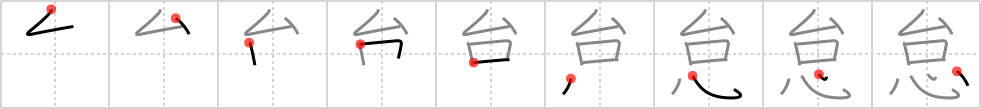

## {745}

## `neglect`

## [9]

## Reading:

### On-Yomi: タイ &mdash; Kun-Yomi: おこた.る、なま.ける

### Examples: 怠る (おこた.る), 怠ける (なま.ける)

## Words:

怠慢(たいまん): negligence, procrastination, carelessness

怠い(だるい): sluggish, feel heavy, languid, dull

怠る(おこたる): neglect, be off guard, be feeling better

怠ける(なまける): be idle, neglect
