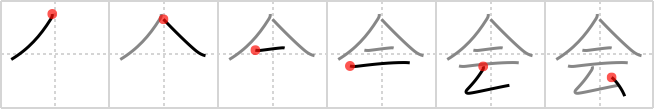

## {752}

## `meeting`

## [6]

## Reading:

### On-Yomi: カイ、エ &mdash; Kun-Yomi: あ.う、あ.わせる、あつ.まる

### Examples: 会話 (かいわ), 会計 (かいけい), 社会 (しゃかい), 会う (あ.う)

## Words:

会(え): understanding

会(かい): meeting, assembly, party, association, club

会見(かいけん): interview, audience

会談(かいだん): conversation, conference, discussion, interview

協会(きょうかい): association, society, organization

再会(さいかい): another meeting, meeting again, reunion

座談会(ざだんかい): symposium, round-table discussion

総会(そうかい): general meeting

出会う(であう): to meet by chance, to come across, to happen to encounter, to hold a rendezvous, to have a date

面会(めんかい): interview

宴会(えんかい): party, banquet

会員(かいいん): member, the membership

開会(かいかい): opening of a meeting

会館(かいかん): meeting hall, assembly hall

会計(かいけい): account, finance, accountant, treasurer, paymaster, reckoning, bill

会合(かいごう): meeting, assembly

学会(がっかい): scientific society, academic meeting

議会(ぎかい): Diet, congress, parliament

国会(こっかい): National Diet, parliament, congress

司会(しかい): chairmanship

社会科学(しゃかいかがく): social science

集会(しゅうかい): meeting, assembly

大会(たいかい): convention, tournament, mass meeting, rally

出会い(であい): meeting, rendezvous, encounter

都会(とかい): city

閉会(へいかい): closure

会議(かいぎ): meeting

会場(かいじょう): the place of meeting

会話(かいわ): conversation

機会(きかい): opportunity, chance

教会(きょうかい): church

社会(しゃかい): society

展覧会(てんらんかい): exhibition

会う(あう): to meet, to interview

会社(かいしゃ): company, corporation
