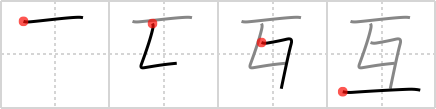

# {互}

## `mutually`

## Strokes: 4

## Reading:

### On-Yomi: ゴ &mdash; Kun-Yomi: たが.い、かたみ.に

### Examples: 互い (たが.い)

## Words:

交互(こうご): mutual, reciprocal, alternate

お互い(おたがい): mutual, reciprocal, each other

相互(そうご): mutual, reciprocal

互い(たがい): mutual, reciprocal
