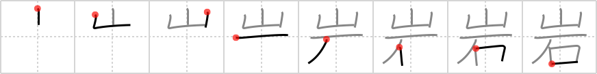

## `boulder`

## [8]

## Reading:

### On-Yomi: ガン &mdash; Kun-Yomi: いわ

## Heisig V6:

Mountain . . . rock.

## Koohii stories:

1) [<a href="http://kanji.koohii.com/profile/smithsonian">smithsonian</a>] 11-12-2006(236): A <em>mountain</em>-sized <em>stone</em> is known as a<strong> boulder</strong>.

2) [<a href="http://kanji.koohii.com/profile/fuaburisu">fuaburisu</a>] 28-10-2005(51): Here we see <em>mountain rocks</em> rolling down the mountain, gathering into a single monstrous<strong> boulder</strong> crushing everything in its path. Think snowball effect, even if it wouldn&#039;t work with rocks.

3) [<a href="http://kanji.koohii.com/profile/Wizard">Wizard</a>] 30-6-2008(42): <strong>Boulder</strong>s are <em>rocks</em> that fall from the <em>mountains</em> above, just like in zelda.

4) [<a href="http://kanji.koohii.com/profile/Rivvie">Rivvie</a>] 5-3-2008(12): A huge<strong> boulder</strong> (<em>rock</em>) is tumbling down from the mountain (towards you! duck!).

5) [<a href="http://kanji.koohii.com/profile/chamcham">chamcham</a>] 14-9-2008(5): <strong>Boulder</strong>, Colorado the <em>rocky mountain</em> state.

6) [<a href="http://kanji.koohii.com/profile/marshallb">marshallb</a>] 24-4-2012(4): In the Crash Bandicoot level &quot;<strong>Boulder</strong> dash&quot;(and others) you&#039;re running down a <em>mountain</em> with a big <em>rock</em>/<strong>boulder</strong> rolling after you. Don&#039;t let it flatten you!

7) [<a href="http://kanji.koohii.com/profile/skiller41">skiller41</a>] 15-1-2012(3): In Pokemon, the foot of <em>mountains</em> are often blocked off by <em>stone</em><strong> boulder</strong>s.

8) [<a href="http://kanji.koohii.com/profile/FoxintheStars">FoxintheStars</a>] 22-8-2010(2): Sisyphus&#039;s<strong> boulder</strong>: he&#039;s always trying to reach the <em>mountain</em> top with this <em>rock</em>.

9) [<a href="http://kanji.koohii.com/profile/Gaignun">Gaignun</a>] 15-6-2010(2): For many years climbers had littered Mount Fuji with trash. Here we see Mount Fuji getting back in the most cinematic way mountains can: by chasing the litterers down the <em>mountain</em>side with huge <em>rocks</em>, namely <strong>boulders</strong>.

10) [<a href="http://kanji.koohii.com/profile/hatman900">hatman900</a>] 28-11-2009(2): A<strong> boulder</strong> is a <em>stone</em> that falls from a <em>mountain</em>.
