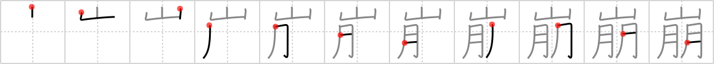

## `crumble`

## [11]

## Reading:

### On-Yomi: ホウ &mdash; Kun-Yomi: くず.れる、-くず.れ、くず.す

### Examples: 崩す (くず.す), 崩れる (くず.れる)

## Words:

雪崩(なだれ): avalanche

崩壊(ほうかい): collapse, decay (physics), crumbling, breaking down, caving in

崩す(くずす): destroy, pull down, make change (money)

崩れる(くずれる): collapse, crumble

## Koohii stories:

1) [<a href="http://kanji.koohii.com/profile/joyeboy">joyeboy</a>] 11-8-2006(260): Sam and Frodo were steadfast <em>companions</em> even as <em>Mount Doom</em><strong> crumble</strong>d above them. 

2) [<a href="http://kanji.koohii.com/profile/liosama">liosama</a>] 6-2-2009(214): September 11. [lol it also has 11 strokes], whoever reported this story is a loser, get alife. This is the best story on the website. 

3) [<a href="http://kanji.koohii.com/profile/nekoyaki">nekoyaki</a>] 9-4-2009(122): Sept 11: The <em>twin towers</em> (=   <a href="http://jisho.org/kanji/details/朋">朋</a>  )<strong> crumble</strong> into a <em>mountain</em> of rubble. (thanks liosama). 

4) [<a href="http://kanji.koohii.com/profile/dihutenosa">dihutenosa</a>] 3-9-2007(67): You and your <em>companion</em> are climbing to the top of the <em>mountain</em> when it suddenly begins to<strong> crumble</strong>. Only one of you can survive - who&#039;s it going to be? You or your <em>companion</em>? 

5) [<a href="http://kanji.koohii.com/profile/Beneus">Beneus</a>] 4-3-2009(24): The reason to always bring a <em>companion</em> when you go climbing in <em>mountains</em>. It is unsteady and may<strong> crumble</strong> under you at any time. That&#039;s when you need that someone to pull you up again. 

6) [<a href="http://kanji.koohii.com/profile/ergerg">ergerg</a>] 7-8-2006(18): Your climbing a MOUNTAIN with your COMPANION, and are running out of food. You quickly stuff the last cookie into you mouth, mumbling &quot;That&#039;s the way the cookie<strong> CRUMBLE</strong>S&quot;. 

7) [<a href="http://kanji.koohii.com/profile/natemb">natemb</a>] 19-7-2009(9): Even <em>mountains</em> will<strong> crumble</strong> over many <em>moons</em>. 

8) [<a href="http://kanji.koohii.com/profile/Nihonnub">Nihonnub</a>] 19-10-2010(6): My <em>companion</em> and I watched as the mountain<strong> crumble</strong>d above us. くずれる 、くずす. 

9) [<a href="http://kanji.koohii.com/profile/tritonxg">tritonxg</a>] 7-1-2010(6): [FR]<strong>s&#039;effondrer</strong> japlt:N1 <strong>HÔ kuzu(seru/su) </strong>k&amp;k 1122 <em>montagne+compagnon(chair+chair) </em><strong>effondrement des twin towers :</strong> Elles se sont EFFONDREES en une MONTAGNE de poussière en ensevelissant les COMPAGNONS du devoir que sont les pompiers  <a href="http://jisho.org/kanji/details/崩し書き">崩し書き</a>  【くずしがき】cursive style character  <a href="http://jisho.org/kanji/details/金融崩壊">金融崩壊</a>  【きんゆうほうかい】financial collapse  <a href="http://jisho.org/kanji/details/雪崩">雪崩</a>  【なだれ】avalanche  <a href="http://jisho.org/kanji/details/崩御">崩御</a>  【ほうぎょ】death of the Emperor  <a href="http://jisho.org/kanji/details/山崩れ">山崩れ</a>  【やまくずれ】landslide  <a href="http://jisho.org/kanji/details/切り崩す">切り崩す</a>  【きりくずす】to level. 

10) [<a href="http://kanji.koohii.com/profile/Clint">Clint</a>] 7-9-2008(5): &quot;If <em>mountains</em><strong> crumble</strong> to the sea, there will still be you and me” sang Led Zeppelin in the song &quot;Thank You.&quot; This character illustrates that sentiment perfectly: a <em>mountain</em> crumbling above while two <em>companions</em> remain below. 
