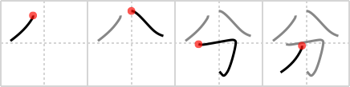

# {分}

## `part`

## Strokes: 4

## Reading:

### On-Yomi: ブン、フン、ブ &mdash; Kun-Yomi: わ.ける、わ.け、わ.かれる、わ.かる、わ.かつ

### Examples: 分解 (ぶんかい), 自分 (じぶん), 水分 (すいぶん), 分別 (ふんべつ), 分銅 (ふんどう), 三十分 (さんじゅうふん), 分かつ (わ.かつ), 分かる (わ.かる), 分かれる (わ.かれる), 分ける (わ.ける)

## Words:

一部分(いちぶぶん): a part

十分(じっぷん): 10 minutes

処分(しょぶん): disposal, dealing, punishment

随分(ずいぶん): pretty much, very much

多分(たぶん): perhaps, probably

手分け(てわけ): division of labour

取り分(とりわけ): especially, above all

配分(はいぶん): distribution, allotment

引き分け(ひきわけ): a draw (in competition), tie game

分(ふん): minute

分業(ぶんぎょう): division of labor, specialization, assembly-line production

分散(ぶんさん): dispersion, decentralization, variance (statistics)

分子(ぶんし): numerator, molecule

分担(ぶんたん): apportionment, sharing

分配(ぶんぱい): division, sharing

分母(ぶんぼ): denominator

分離(ぶんり): separation, detachment, segregation, isolation

分裂(ぶんれつ): split, division, break up

申し分(もうしぶん): objection, shortcomings

分かる(わかる): to be understood

幾分(いくぶん): somewhat

区分(くぶん): division, section, compartment, demarcation, (traffic) lane, classification, sorting

水分(すいぶん): moisture

成分(せいぶん): ingredient, component, composition

大分(だいぶ): very, many, a lot

大部分(だいぶぶん): most part, greater part, majority

大分(だいぶん): considerably, greatly, a lot

等分(とうぶん): division into equal parts

何分(なにぶん): anyway, please

引分け(ひきわけ): tie game, draw

分(ぶ): rate, part, percentage, one percent, thickness, odds, chance of winning, one-hundredth of a shaku, one-quarter of a ryou

分野(ぶんや): field, sphere, realm, division, branch

部分(ぶぶん): portion, section, part

分(ぶん): part, segment, share, ration, rate, degree, one´s lot, one´s status, relation, duty, kind, lot, in proportion to, just as much as

分解(ぶんかい): analysis, disassembly

分数(ぶんすう): (mathematics) fraction

分析(ぶんせき): analysis

分布(ぶんぷ): distribution

分量(ぶんりょう): amount, quantity

分類(ぶんるい): classification

身分(みぶん): social position, social status

養分(ようぶん): nourishment, nutrient

余分(よぶん): extra, excess, surplus

分かれる(わかれる): branch off, diverge from, fork, split, dispense, scatter, divide into

分ける(わける): divide, separate, make distinctions, differentiate (between)

気分(きぶん): mood

十分(じゅうぶん): enough

自分(じぶん): myself, oneself

半分(はんぶん): half

分る(わかる): be understood
