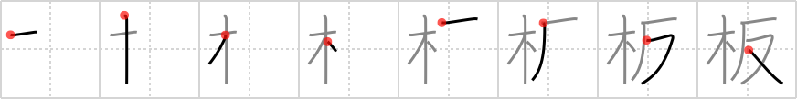

## `plank`

## [8]

## Reading:

### On-Yomi: ハン、バン &mdash; Kun-Yomi: いた

## Heisig story:

Tree . . . anti-.

## Koohii stories:

1) [<a href="http://kanji.koohii.com/profile/mspertus">mspertus</a>] 5-7-2006(390): Of course, <em>trees</em> are <em>anti-</em>plank. Wouldn&#039;t you be if you were a <em>tree</em>?

2) [<a href="http://kanji.koohii.com/profile/ergerg">ergerg</a>] 24-6-2006(32): Trees are naturally opposed to, or anti, the making of<strong> plank</strong>s.

3) [<a href="http://kanji.koohii.com/profile/zdude255">zdude255</a>] 13-6-2008(22): Trees are definitely anti-plank. They&#039;re even having a protest. Ironically the signs are still made of paper.

4) [<a href="http://kanji.koohii.com/profile/Spidercat">Spidercat</a>] 23-12-2007(16): Our <em>anti</em> hero Dirty Harry is having a pirate fantasy about pushing the villain from a <em>tree</em><strong> plank</strong>.

5) [<a href="http://kanji.koohii.com/profile/Pete171">Pete171</a>] 2-10-2008(11): A <strong>plank</strong> of wood is made from <em>trees</em>. Obviously <em>trees</em> are&quot;<em>anti-</em><strong>plank</strong>&quot; since they are cut down and shaped to be made into <strong>planks</strong>. Now imagine a demonstration of anti-<strong>plank</strong> <em>trees</em> protesting against their massacre by grouping together and waving around their campaign slogans in the air on signs. And what are those signs made of out, people? Irony.

6) [<a href="http://kanji.koohii.com/profile/alatown">alatown</a>] 19-10-2009(7): This time <strong>Wile Coyote</strong> (the perfect <em>antihero</em> remember) tries to use an ACME <em>wood</em>en<strong> plank</strong> to spring upon the Road Runner from above. Jumping at the critical moment, he slips, lands on his crotch and predictably falls off the cliff.

7) [<a href="http://kanji.koohii.com/profile/hanamijin">hanamijin</a>] 24-5-2010(5): The<strong> plank</strong> industry is definitely anti-tree.

8) [<a href="http://kanji.koohii.com/profile/jaresty">jaresty</a>] 8-10-2007(5): The anti-hero, when a on a boat, will of course make his villains walk the wooden<strong> plank</strong> (off the left side of the boat).

9) [<a href="http://kanji.koohii.com/profile/roderik">roderik</a>] 11-6-2008(4): Hard Gay tries to &#039;Hoo!&#039; a <em>tree</em> down a cliff with his <em>crotch</em>, but alass, the <em>tree</em> remains standing still.

10) [<a href="http://kanji.koohii.com/profile/gavin.schultz-ohkubo">gavin.schultz-ohkubo</a>] 13-5-2010(3): ...but just when you thought the villain got away on his gadget skis, <em>anti</em>-hero Dirty Harry&#039;s partner at the bottom of the cliff whacks the villain across the face with a <em>wooden</em><strong> plank</strong>, and he tumbles down for the count. Punk.
