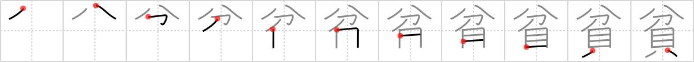

## `poverty`

## [11]

## Reading:

### On-Yomi: ヒン、ビン &mdash; Kun-Yomi: まず.しい

## Koohii stories:

1) [<a href="http://kanji.koohii.com/profile/darg_sama">darg_sama</a>] 9-11-2005(255): In the case of true<strong> poverty</strong>, not having money is only part of the problem. There are other components as well, like lack of education, class structuring, etc., but that doesn&#039;t really matter. Just remember that the money is only part of it, not the whole. 

2) [<a href="http://kanji.koohii.com/profile/bokuzukuri">bokuzukuri</a>] 5-1-2006(123): Parting with your money will lead to<strong> poverty</strong>. 

3) [<a href="http://kanji.koohii.com/profile/fuaburisu">fuaburisu</a>] 23-1-2006(41): Nice one darg_sama. Since I imagine <em>part</em> as a section of a pie chart, I&#039;ll think of a pie chart representing the causes of<strong> poverty</strong>. <em>Shells</em> (lack of money) is just one <em>part</em> of the pie chart. 

4) [<a href="http://kanji.koohii.com/profile/Chocobonstrife">Chocobonstrife</a>] 26-4-2012(26): <strong>Poverty</strong> is having only a PART of the MONEY you need to get by. 

5) [<a href="http://kanji.koohii.com/profile/decals">decals</a>] 5-11-2008(25): Imagine someone so poor they only have part of a penny(or shell). 

6) [<a href="http://kanji.koohii.com/profile/Spidercat">Spidercat</a>] 11-1-2008(15): 20% of world population owns a 80% <em>part</em> of all the <em>money</em>. No wonder there is so much<strong> poverty</strong>! 

7) [<a href="http://kanji.koohii.com/profile/sethg">sethg</a>] 25-3-2009(6): Being in<strong> poverty</strong> means you&#039;ve <em>part</em>ed with any <em>shells</em> you might&#039;ve once had. 

8) [<a href="http://kanji.koohii.com/profile/shoopa">shoopa</a>] 24-6-2010(5): If the top 5% earners in the world gave just a very, very small <em>part</em> of their <em>clams</em> to the needy,<strong> poverty</strong> could be drastically reduced. Looked at the other way, people living in<strong> poverty</strong> can get by on a very small <em>part</em> (fraction) of the <em>clams</em> that the richest people in the world make. 

9) [<a href="http://kanji.koohii.com/profile/Wosret">Wosret</a>] 29-11-2008(4): People in<strong> poverty</strong> have little to no <strong>money</strong> to <strong>part</strong> with. 

10) [<a href="http://kanji.koohii.com/profile/ivantolearnkanji">ivantolearnkanji</a>] 26-4-2008(4): Don&#039;t confuse with <a href="../1215">destitution</a> (#1215 <a href="http://jisho.org/kanji/details/乏">乏</a>).<strong> Poverty</strong> is something that NGOs try to fight with programs that encourage people to <em>part</em> with their <em>shells</em> to share with the less fortunate, while destitution is the way it looks from the perspective of the destitute. 
