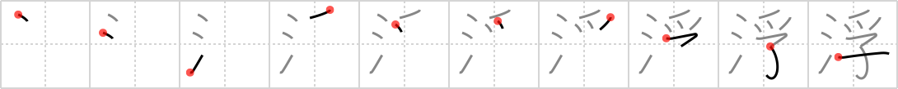

## `floating`

## [10]

## Reading:

### On-Yomi: フ &mdash; Kun-Yomi: う.く、う.かれる、う.かぶ、む、う.かべる

## Heisig story:

Water . . . fledglings.

## Koohii stories:

1) [<a href="http://kanji.koohii.com/profile/ivoSF">ivoSF</a>] 13-7-2006(237): <strong>Floating</strong> rubber ducky!!!

2) [<a href="http://kanji.koohii.com/profile/fuaburisu">fuaburisu</a>] 10-10-2005(99): A nest of fledglings somehow fell into the water (maybe it was perched on a tree bending over the river), but they are safe for now as the nest is<strong> floating</strong>. The fledglings are enjoying the cruise but they are soon coming to a great waterfall... ( a little drama to help us remember the story).

3) [<a href="http://kanji.koohii.com/profile/dwhitman">dwhitman</a>] 1-11-2007(39): An ugly duckling (<em>fledgling</em>)<strong> FLOATING</strong> in the <em>water</em>. But this one doesn&#039;t grow up into a swan - he&#039;s a <em>vulture</em>.

4) [<a href="http://kanji.koohii.com/profile/Nukemarine">Nukemarine</a>] 30-8-2007(30): Not too difficult. When you hear<strong> FLOATING</strong>, just think of baby ducks (FLEDGELINGS) in the WATER. Well, you&#039;re pretty sure WATER has alot to do with this Kanji.

5) [<a href="http://kanji.koohii.com/profile/crystalcastlecreature">crystalcastlecreature</a>] 14-10-2009(18): <strong>The noon sun makes walking on the sand feel so warm. The sea breeze feels so soothing as it caresses my skin. And in the water, dead little fledgings are<strong> floating</strong>. How nice. (and btw, that was sarcasm you dumb douchebags that flagged this!! if you flag, you=DOUCHE OF THE YEAR!!!!)</strong>.

6) [<a href="http://kanji.koohii.com/profile/Doodsaq">Doodsaq</a>] 18-12-2007(8): Baby wolverine tried to grab the rubber ducky<strong> floating</strong> in the water. Adamantium weights a lot though he slipped sunk like a rock instead.

7) [<a href="http://kanji.koohii.com/profile/mezbup">mezbup</a>] 15-1-2009(5): Vultures circled the child<strong> floating</strong> in the water.

8) [<a href="http://kanji.koohii.com/profile/DavidZ">DavidZ</a>] 30-4-2010(4): The &quot;<strong>floating</strong> world&quot; (ukiyo = 浮世 ) is depicted in ukiyo-e prints. This is where the Edo-era middle class enjoyed<strong> floating</strong> around the Yoshiwara pleasure quarters, much like a <em>fledgling</em> duck floats around in the <em>water</em>... 浮く [うく] <a href="midori://search?text=、浮遊">、浮遊</a> [ふゆう]<strong> floating</strong>.

9) [<a href="http://kanji.koohii.com/profile/brainrobert1">brainrobert1</a>] 14-11-2010(3): Water + fledglings =<strong> floating</strong> The mother duck pushed her FLEDGINGS into the WATER to show them they would ｗould float, not sink. float is 浮かぶ ukabu; sink is　bossuru 没する .

10) [<a href="http://kanji.koohii.com/profile/dnanoodle">dnanoodle</a>] 8-12-2009(3): This is the real ugly duckling, not the story of a swan, but of a vulture. He fell in the <em>water</em> as a <em>fledgling</em> because he couldn&#039;t fly. Now he is<strong> floating</strong> there in shame.
