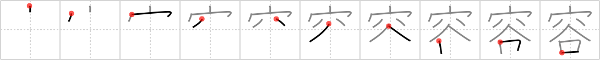

# {容}

## `contain`

## Strokes: 10

## Reading:

### On-Yomi: ヨウ &mdash; Kun-Yomi: い.れる

## Words:

寛容(かんよう): forbearance, tolerance, generosity

許容(きょよう): permission, pardon

収容(しゅうよう): accommodation, reception, seating, housing, custody, admission, entering (in a dictionary)

容易い(たやすい): easy, simple, light

形容詞(けいようし): "true" adjective

形容動詞(けいようどうし): adjectival noun, quasi-adjective

内容(ないよう): subject, contents, matter, substance, detail, import

美容(びよう): beauty of figure or form

容易(ようい): easy, simple, plain

容器(ようき): container, vessel

容積(ようせき): capacity, volume
