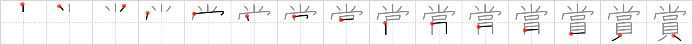

## {796}

## `prize`

## [15]

## Reading:

### On-Yomi: ショウ &mdash; Kun-Yomi: ほ.める

## Words:

懸賞(けんしょう): offering prizes, winning, reward

入賞(にゅうしょう): winning a prize or place (in a contest)

鑑賞(かんしょう): appreciation

賞(しょう): prize, award

賞金(しょうきん): prize, monetary award

賞品(しょうひん): prize, trophy
