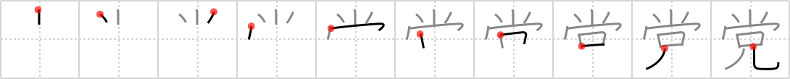

# {党}

## `party`

## Strokes: 10

## Reading:

### On-Yomi: トウ &mdash; Kun-Yomi: なかま、むら

## Words:

野党(やとう): opposition party

与党(よとう): government party, (ruling) party in power, government

政党(せいとう): (member of) political party

党(とう): party (political), faction, -ite
