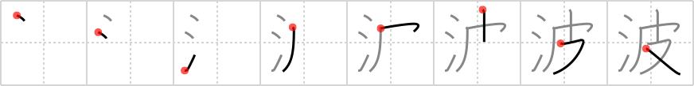

# {波}

## `waves`

## Strokes: 8

## Reading:

### On-Yomi: ハ &mdash; Kun-Yomi: なみ

### Examples: 波 (なみ)

## Words:

短波(たんぱ): short wave

津波(つなみ): tsunami, tidal wave

電波(でんぱ): electro-magnetic wave

波(なみ): wave
