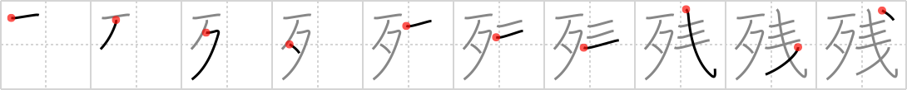

# {残}

## `remainder`

## Strokes: 10

## Reading:

### On-Yomi: ザン、サン &mdash; Kun-Yomi: のこ.る、のこ.す、そこな.う、のこ.り

### Examples: 残す (のこ.す), 残る (のこ.る)

## Words:

残金(ざんきん): remaining money

残酷(ざんこく): cruelty, harshness

残高(ざんだか): (bank) balance, remainder

名残(なごり): remains, traces, memory

残り(のこり): remnant, residue, remaining, left-over

残す(のこす): leave (behind, over), bequeath, save, reserve

残らず(のこらず): all, entirely, completely, without exception

残念(ざんねん): sorry

残る(のこる): remain
