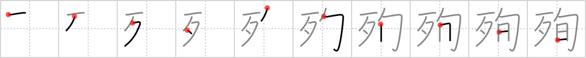

## `martyrdom`

## [10]

## Reading:

### On-Yomi: ジュン

## Heisig story:

Bones . . . decameron.

## Koohii stories:

1) [<a href="http://kanji.koohii.com/profile/Johnnyltn">Johnnyltn</a>] 14-8-2006(224): Think of the early Christian martyrs who suffered<strong> martyrdom</strong> because of their faith. See them held in cells for 10 days (a decameron) before being fed to the lions. They appear before the chanting Roman crowds as <em>bones</em> to be devoured. Think of what was leftover after the lions finished them off....nothing, not even a pile of <em>bones</em> to bury.

2) [<a href="http://kanji.koohii.com/profile/ruisu">ruisu</a>] 14-11-2007(86): The <em>boney</em> man martyred himself during his 10 day hunger-strike.

3) [<a href="http://kanji.koohii.com/profile/imojyochu">imojyochu</a>] 23-8-2008(72): To commerate the saint&#039;s <strong>martyrdom</strong> his BONES will be displayed for a 10-DAY-PERIOD (decameron).

4) [<a href="http://kanji.koohii.com/profile/yukkuri_kame">yukkuri_kame</a>] 21-6-2009(46): After being bound up for a day (see <a href="../67">decameron</a> (#67 旬)) there was nothing left of Heisig but BONES. He had attained<strong> MARTYRDOM</strong> for the sake of an obscure keyword...

5) [<a href="http://kanji.koohii.com/profile/dingomick">dingomick</a>] 19-2-2007(19): Nice. If you know about the Canterbury Tales, you know they were pilgrims going to see a martyrs tomb. Just imagine that they&#039;re going to see the <em>relics(bones)</em> of that <strong>martyr</strong> on their <em>decameron</em>!

6) [<a href="http://kanji.koohii.com/profile/cricket">cricket</a>] 13-4-2008(11): The<strong> martyrdom</strong> of the man who withstood his beatings for 10 days until all that remained of him was bones.

7) [<a href="http://kanji.koohii.com/profile/gnyffel">gnyffel</a>] 12-7-2009(10): <strong>Martyrdom</strong>: the success of a suicide bomber is assured if cleaning up the <em>bones</em> takes more than <em>ten days</em>.

8) [<a href="http://kanji.koohii.com/profile/meeatcookies">meeatcookies</a>] 7-8-2012(9): After <em>decameron</em> (10 days) of<strong> martyrdom</strong>, all that was left from him were <em>bones</em>! (ever watched berserk with Griffith being tortured?).

9) [<a href="http://kanji.koohii.com/profile/Stormchild">Stormchild</a>] 17-7-2006(8): One&#039;s bones are sticking out after fasting for 10 days in an act of<strong> martyrdom</strong>.

10) [<a href="http://kanji.koohii.com/profile/gavin.schultz-ohkubo">gavin.schultz-ohkubo</a>] 18-5-2010(5): Lucky me - my wife&#039;s name is 旬子 （じゅんこ） so I just imagine that when Junko dies I&#039;ll sell her <em>bones</em> to naive tourists, saying she was one of the great <strong>martyrs</strong>. (Finally, a perk of being married! :P).
