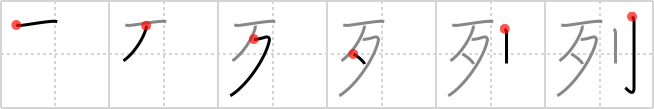

## {812}

## `file`

## [6]

## Reading:

### On-Yomi: レツ、レ

## Words:

整列(せいれつ): stand in a row, form a line

陳列(ちんれつ): exhibition, display, show

配列(はいれつ): arrangement, array (programming)

並列(へいれつ): arrangement, parallel, abreast

行列(ぎょうれつ): line, procession, matrix (mathematics)

列(れつ): line, row

列車(れっしゃ): train (ordinary)

列島(れっとう): chain of islands
